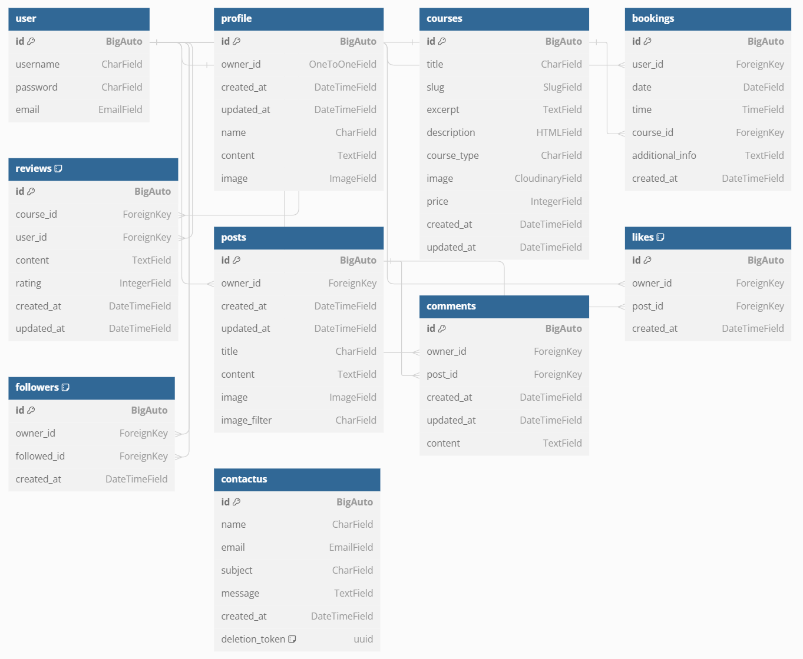

<p align="center">
  
</p>
<h1 align="center">Diving Center API - Django Rest Framework</h1>

[Diving Center Django Rest Framework API Backend Live Link](https://pp5api-divingspace-f0baea7c564e.herokuapp.com/)

[Diving Center React Frontend Live Link](https://divingspace-900b5a3db777.herokuapp.com/)

[Diving Center React Frontend Github Repo](https://github.com/AmirShkolnik/DivingCenter)

[Diving Center DRF API Testing](TESTING.md)

## Project Goals

### Diving Center - A Community for Scuba Enthusiasts

* **Build a thriving online community:** Build a welcoming space for scuba divers of all levels to connect, share experiences, and learn from each other. [Click to watch the diving center home page](https://divingspace-900b5a3db777.herokuapp.com/courses)

* **Simplify course booking and management:** Allow divers to easily browse and book diving courses directly through the platform. [Courses page](https://divingspace-900b5a3db777.herokuapp.com/courses) ; [Course review and rating](https://divingspace-900b5a3db777.herokuapp.com/courses/advanced-open-water-diver) ; [Contact form](https://divingspace-900b5a3db777.herokuapp.com/contactus)

* **Enhance learning and discovery:** Provide a platform for logged in members to share their diving experiences, reviews, and photos, enriching the knowledge base for the community.

* **Empower user interaction:**  Enable logged in members to follow each other, like and comment on posts, creating a dynamic and engaging social experience. [Click to watch users feed](https://divingspace-900b5a3db777.herokuapp.com/feed)

**Technology Stack:**

* **Django REST Framework (Backend):** A powerful Python web framework that provides a robust foundation for building APIs (Application Programming Interfaces). These APIs will handle data management and communication between the application's frontend and backend. [Diving Center Django Rest Framework API Backend Live Link](https://pp5api-divingspace-f0baea7c564e.herokuapp.com/)

* **React (Frontend):** A popular JavaScript library for building user interfaces. React allows for the creation of interactive and responsive web pages that adapt to different devices. [Diving Center React Frontend Live Link](https://divingspace-900b5a3db777.herokuapp.com/)

**Key functionalities:**

* **User Management:**  Support for both regular users and admin accounts.

* **Course Management:**  Divers can view course information, book courses, and leave reviews. 

* **Content Sharing:**  Divers can create posts, share images, and interact with each other's content through likes, comments, and follows.

* **Admin Panel:**  Admins can manage user accounts, courses, and website content.

This combination of technologies empowers a feature-rich and interactive online platform catering to the needs of scuba diving enthusiasts.

[Visit Our Diving Center Website](https://divingspace-900b5a3db777.herokuapp.com/)

## Table of contents
- [Project Goals](#project-goals)
- [Table of contents](#table-of-contents)
- [Planning](#planning)
  - [Project Overview](#project-overview)
  - [Objectives](#objectives)
  - [Timeline](#timeline)
- [Data Models](#data-models)
  - [User Model](#user-model)
  - [Profile Model](#profile-model)
  - [Courses Model ](#courses-model)
  - [Bookings Model](#bookings-model)
  - [Reviews Model](#reviews-model)
  - [Posts Model](#posts-model)
  - [Comments Model](#comments-model)
  - [Likes Model](#likes-model)
  - [Followers Model](#followers-model)
  - [Contact Us Model](#contact-us-model)
- [API Endpoints](#api-endpoints)
- [Frameworks, Libraries, and Dependencies](#frameworks-libraries-and-dependencies)
  - [Django Framework and Extensions](#django-framework-and-extensions)
  - [Database Management](#database-management)
  - [Authentication and Security](#authentication-and-security)
  - [Storage and Image Handling](#storage-and-image-handling)
  - [Application Server](#application-server)
  - [Utility Libraries](#utility-libraries)
- [Testing and Validation](#testing-and-validation)
- [Bugs](#bugs)
- [Deployment](#deployment)
  - [GitHub](#github)
  - [Gitpod](#gitpod)
  - [Heroku](#heroku)
  - [CI database](#ci-database)
  - [Cloudinary](#cloudinary)
- [Cloning and Forking](#cloning-and-forking)
  - [Cloning the Repository](#cloning-the-repository)
  - [Forking the Repository](#forking-the-repository)
- [Credits](#credits)
  - [Code](#code)
  - [Media](#media)
- [Acknowledgements](#acknowledgements)
  - [Inspiration](#inspiration)
  - [Project Guidance](#project-guidance)

Based on the information provided and the structure you've requested, here's a robust project planning for your diving center project, covering both backend and frontend development over an 8-week period:

## Planning

### Project Overview

This project is a comprehensive web application for a diving center. It allows users to view diving courses, book courses, leave reviews, and interact with a community of divers. The application will have a Django backend with a REST API, and a React frontend. Key features include user authentication, course management, booking system, review system, and a community feed.

### Objectives

1. Develop a secure and scalable backend API using Django and Django REST Framework.
2. Create an intuitive and responsive frontend using React.
3. Implement user authentication and authorization.
4. Develop a course management system with detailed course pages.
5. Create a booking system for users to reserve courses.
6. Implement a review and rating system for courses.
7. Develop a community feed for user interactions.
8. Ensure the application is responsive and works well on various devices.

### Timeline

#### Week 1: Project Setup and Backend Foundations
- Day 1-2: Project initialization, environment setup
- Day 3-4: Database design, create Django models (User, Course, Booking, Review)
- Day 5: Set up Django REST Framework, create basic API views

#### Week 2: Backend Development - Core Features
- Day 1-2: Implement user authentication (registration, login, logout)
- Day 3-4: Develop course API endpoints (list, detail, create, update, delete)
- Day 5: Create booking system API endpoints

#### Week 3: Backend Development - Advanced Features
- Day 1-2: Implement review system API endpoints
- Day 3-4: Develop community feed API endpoints
- Day 5: Add filtering, pagination, and search functionality to API

#### Week 4: Backend Finalization and Frontend Setup
- Day 1-2: Backend testing and bug fixes
- Day 3: API documentation
- Day 4-5: Set up React project, implement routing, create basic components

#### Week 5: Frontend Development - Core Features
- Day 1-2: Implement user authentication on frontend
- Day 3-4: Develop course listing and detail pages
- Day 5: Create booking form and integration with API

#### Week 6: Frontend Development - Advanced Features
- Day 1-2: Implement review system on frontend
- Day 3-4: Develop community feed components
- Day 5: Add search and filtering functionality on frontend

#### Week 7: Frontend Styling and Responsiveness
- Day 1-2: Implement responsive design
- Day 3-4: Style components and pages
- Day 5: Implement loading states and error handling

#### Week 8: Testing, Optimization, and Deployment
- Day 1-2: Comprehensive testing (unit tests, integration tests)
- Day 3: Performance optimization (backend and frontend)
- Day 4: Prepare for deployment (configuration, environment variables)
- Day 5: Deploy application, final testing in production environment

This timeline provides a structured approach to develop the diving center application over 8 weeks. It covers all major aspects of both backend and frontend development, from initial setup to final deployment. This schedule might change during development as some tasks may take more or less time than anticipated.

[Back to top](#table-of-contents)

## Data Models

The data models for this diving center application represent a comprehensive and interconnected system designed to manage users, courses, bookings, reviews, social interactions, and customer inquiries. These models form the backbone of a feature-rich platform that caters to both the operational needs of a diving center and the social aspects of a diver community.

**Database Schema**

The database schema is carefully crafted to ensure efficient data storage, retrieval, and relationships between various entities. It utilizes Django's ORM (Object-Relational Mapping) to create a robust and scalable database structure. The schema incorporates both built-in Django models and custom-designed models to meet the specific requirements of the diving center application.

**Entity Relationship Diagram (ERD)**

The ERD visually represents the complex relationships between different entities in the system. It illustrates how users interact with courses, bookings, and reviews, as well as how social features like posts, comments, likes, and followers are interconnected. This diagram serves as a crucial tool for understanding the data flow and dependencies within the application. We used [dbdiagram.io](https://dbdiagram.io) to design the ERD.



**Technical Architecture**

**Technical Design:** The application follows a modular design approach, separating concerns into distinct models. This design facilitates easier maintenance, scalability, and future enhancements. The use of Django's built-in User model as a foundation ensures robust authentication and authorization mechanisms.

**Model-Based Design:** Each model is designed to encapsulate specific functionalities and data related to a particular aspect of the application. This approach allows for clear separation of concerns and promotes code reusability.

**Relational Data Modeling:** The database design leverages relational modeling techniques to establish connections between different entities. Foreign key relationships are used extensively to maintain data integrity and enable efficient querying across related data sets.

**Entities Overview**

This table provides a clear overview of the database structure, showing the different tables and their respective purposes within the application. Each table is designed to handle specific aspects of the system, from user management to course bookings and social interactions.

| Entities | Purpose |
|------------|---------|
| User | Manages user authentication and basic information |
| Profile | Extends user information with additional details and preferences |
| Courses | Stores information about available diving courses, including details like title, description, type, and price |
| Bookings | Handles course reservations made by users, including date, time, and additional information |
| Reviews | Allows users to rate and review courses, with content and rating |
| Posts | Manages user-generated content for the community feed, including images and filters |
| Comments | Enables users to comment on posts, with creation and update timestamps |
| Likes | Tracks user likes on posts, with creation timestamps |
| Followers | Manages user follow relationships, tracking who follows whom |
| Contact Us| Stores customer inquiries and messages, including a deletion token for privacy |

[Back to top](#table-of-contents)

**Relationships**

The relationships between these models create a cohesive system:

- Users are linked to Profiles, Bookings, Reviews, Posts, Comments, Likes, and Followers.
- DivingCourses are connected to Bookings and Reviews.
- Posts are associated with Comments and Likes.
- Followers establish connections between users.

The following tables illustrates the relationships between different models in the system. It shows how users are connected to various other entities like profiles, bookings, reviews, posts, comments, likes, and followers. It also demonstrates the connections between diving courses and their bookings and reviews, as well as the relationship between posts and their comments and likes. Lastly, it represents the follower relationship between users.

| Model 1 | Relationship | Model 2 |
|---------|--------------|---------|
| User | has one | Profile |
| User | has many | Bookings |
| User | has many | Reviews/Ratings (through Courses) |
| User | has many | Posts |
| User | has many | Comments |
| User | has many | Likes |
| User | has many | Followers |
| User | has many | Contacts |
| User | follows many | User |
| Courses | has many | Bookings |
| Courses | has many | Reviews/Ratings |
| Post | has many | Comments |
| Post | has many | Likes |
| Post | belongs to | User |
| Comment | belongs to | User |
| Like | belongs to | User |
| Follower | belongs to | User |

[Back to top](#table-of-contents)

This table outlines the key relationships between the models in the diving center application, showing how different entities are connected and interact within the system.

| Relationship Type | Primary Model | Related Model | Description |
|-------------------|---------------|---------------|-------------|
| One-to-One | User | Profile | Each user has one profile |
| One-to-Many | User | Booking | One user can make many bookings |
| One-to-Many | DivingCourse | Booking | One diving course can have many bookings |
| One-to-Many | DivingCourse | Review | One diving course can have many reviews |
| One-to-Many | User | Review | One user can write many reviews |
| One-to-Many | User | Post | One user can create many posts |
| One-to-Many | User | Comment | One user can write many comments |
| One-to-Many | Post | Comment | One post can have many comments |
| One-to-Many | User | Like | One user can like many posts |
| One-to-Many | Post | Like | One post can have many likes |
| Many-to-Many | User | User | Users can follow many users (through Follower model) |
| One-to-Many | User | Contact | One user can submit many contact messages |
| Many-to-One | Post | User | Many posts belong to one user (owner) |
| Many-to-One | Comment | User | Many comments belong to one user (owner) |
| Many-to-One | Like | User | Many likes belong to one user (owner) |
| Many-to-One | Follower | User | Many follower relationships involve one user (as follower or followed) |

[Back to top](#table-of-contents)

### User Model

The User model is a fundamental component of the diving center application, serving as the cornerstone for user authentication, authorization, and management. This model leverages Django's built-in User model, which provides a robust and secure foundation for handling user-related functionalities.

**Key Features**:
1. **Authentication**: Manages user login credentials and authentication processes.
2. **Identity Management**: Provides a unique identifier for each user in the system.
3. **Security**: Ensures secure storage of user passwords through hashing.
4. **Communication**: Stores email addresses for user communication and account-related notifications.

**Fields**:

| Field | Attribute | Description |
|-------|-----------|-------------|
| id | BigAutoField | Unique identifier for each user, automatically generated |
| username | CharField | Unique username used for login and identification |
| password | CharField | Securely hashed password, never stored in plain text |
| email | EmailField | User's email address for account communication and notifications |

**Implementation Notes**:
- The User model is part of Django's authentication system, located in `django.contrib.auth.models`.
- By utilizing Django's built-in User model, the application inherits a range of security features and best practices for user management.
- The `username` field is unique across all users, ensuring each user has a distinct identifier.
- Passwords are automatically hashed before storage, enhancing security by not storing plain-text passwords.
- The model supports additional fields like `first_name`, `last_name`, `is_staff`, `is_active`, etc., which can be utilized as needed.
- This model serves as a foreign key reference for many other models in the application, establishing relationships between users and various entities like bookings, reviews, and profiles.

**Advantages of Using Django's User Model**:
1. **Security**: Implements best practices for password hashing and user authentication out of the box.
2. **Scalability**: Designed to handle a large number of users efficiently.
3. **Integration**: Seamlessly integrates with Django's admin interface and authentication views.
4. **Extensibility**: Can be easily extended with a custom user model or through one-to-one relationships with other models (like a Profile model) if additional fields are needed.

The User model plays a crucial role in the application by:
- Enabling secure user registration and login processes.
- Providing a basis for user-specific data and permissions throughout the application.
- Facilitating features like user profiles, personalized bookings, and user-generated content (reviews, comments).

By leveraging Django's User model, the diving center application ensures a solid, secure, and scalable foundation for user management, allowing the development team to focus on building domain-specific features while relying on Django's battle-tested user authentication system.

[Back to top](#table-of-contents)

### Profile Model

The Profile model is an extension of the User model, designed to store additional, detailed information about each user. This model creates a more comprehensive and personalized user profile, enhancing the user experience and providing richer user data for the diving center application.

**Key Features**:
1. **User Extension**: Directly linked to the User model, allowing for seamless integration of additional user information.
2. **Personalization**: Stores personal details like full name and biography, enabling a more personalized user experience.
3. **Visual Identification**: Includes an image field for profile pictures, adding a visual element to user profiles.
4. **Timestamp Tracking**: Records creation and update times, providing a history of profile changes.

**Fields**:

| Field | Attribute | Description |
|-------|-----------|-------------|
| id | BigAutoField | Unique identifier for each profile, automatically generated |
| owner | OneToOneField | Establishes a one-to-one relationship with the User model, ensuring each user has exactly one profile |
| created_at | DateTimeField | Timestamp recording when the profile was first created |
| updated_at | DateTimeField | Timestamp that updates whenever the profile information is modified |
| name | CharField | User's full name, providing a more personal identifier than the username |
| content | TextField | Biographical information or user description, allowing users to share more about themselves |
| image | ImageField | Field for storing the user's profile picture |

**Implementation Notes**:
- The Profile model is typically defined in a separate app (e.g., `profiles/models.py`), emphasizing its role in extending user information.
- The `OneToOneField` to the User model ensures a direct, one-to-one correlation between User and Profile instances.
- Profile creation can be automated using Django signals, creating a profile automatically when a new user is registered.
- The `image` field often uses Django's ImageField, which requires additional setup for file storage (e.g., using Django's FileSystemStorage or cloud storage solutions).

**Advantages of Using a Separate Profile Model**:
1. **Flexibility**: Allows for easy addition of user-related fields without modifying the core User model.
2. **Separation of Concerns**: Keeps authentication-related fields (in the User model) separate from additional profile information.
3. **Customization**: Enables easy customization of user profiles without affecting the authentication system.
4. **Performance**: Can improve database performance by separating frequently accessed authentication data from less frequently accessed profile data.

The Profile model enhances the application by:
- Providing a richer user experience with more detailed user information.
- Enabling features like user galleries, personalized dashboards, and social aspects of the platform.
- Allowing for easy expansion of user-related data as the application grows and evolves.

In the context of the diving center application, the Profile model could be further customized to include diving-specific information such as certification levels, diving experience, or preferred diving locations. This model plays a crucial role in creating a community feel within the application and can be leveraged for features like personalized course recommendations or social networking among divers.

[Back to top](#table-of-contents)

### Courses Model

The Courses model is a central component of the diving center application, designed to represent and manage the various diving courses offered by the center. This model encapsulates all relevant information about each course, providing a comprehensive and structured approach to course management.

**Key Features**:
1. **Detailed Course Information**: The model captures a wide range of details about each course, from basic information like title and price to more comprehensive descriptions.
2. **SEO-Friendly URLs**: Utilizes a slug field for creating user-friendly and search engine optimized URLs.
3. **Rich Content Support**: Incorporates HTML-enabled descriptions, allowing for formatted and visually appealing course details.
4. **Image Management**: Integrates with Cloudinary for efficient storage and retrieval of course images.
5. **Categorization**: Includes a course type field for easy categorization and filtering of courses.
6. **Timestamp Tracking**: Records both creation and update times, providing a history of course modifications.

**Fields**:

| Field | Attribute | Description |
|-------|-----------|-------------|
| id | BigAutoField | Unique identifier for each course, automatically generated |
| title | CharField | The name or title of the diving course |
| slug | SlugField | A URL-friendly version of the title, used for creating clean, readable URLs |
| excerpt | TextField | A brief summary or introduction to the course, useful for quick overviews |
| description | HTMLField | A detailed description of the course, supporting HTML for rich formatting |
| course_type | CharField | Categorization of the course (e.g., beginner, advanced, specialty) |
| image | CloudinaryField | An image representing the course, stored and managed via Cloudinary |
| price | IntegerField | The cost of the course |
| created_at | DateTimeField | Timestamp recording when the course was first added to the system |
| updated_at | DateTimeField | Timestamp that updates whenever the course information is modified |

**Implementation Notes**:
- The Courses model is defined in the `courses/models.py` file, serving as the foundation for course-related functionality.
- The `slug` field is typically auto-generated from the title, ensuring unique and SEO-friendly URLs for each course.
- The use of `HTMLField` for the description allows for rich text formatting, enhancing the presentation of course details.
- The `CloudinaryField` for the image integrates with the Cloudinary service, providing efficient image management and delivery.
- The `course_type` field can be implemented with choices to ensure consistency in course categorization.
- Timestamp fields (`created_at` and `updated_at`) are automatically managed, providing a clear history of when courses are added or modified.

This model structure allows for efficient management of course offerings, providing all necessary information for both administrative purposes and user display. It supports various features like course listings, detailed course pages, and integration with booking and review systems, forming a cornerstone of the diving center's digital infrastructure.

[Back to top](#table-of-contents)

You can explain the Bookings model as follows:

### Bookings Model

The Bookings model is a crucial component of the diving center application, responsible for managing course reservations made by users. This model ensures that all booking-related information is systematically stored and easily retrievable, facilitating efficient course management and user experience.

**Key Features**:
1. **User-Course Relationship**: Each booking is linked to both a specific user and a specific course, ensuring clear and organized reservation records.
2. **Time and Date Management**: The model captures both the date and time of the booking, allowing for precise scheduling of courses.
3. **Additional Information**: Users can provide extra details related to their booking, which can be useful for instructors and administrative staff.
4. **Timestamp Tracking**: The creation time of each booking is recorded, providing a chronological order of reservations.

**Fields**:

| Field | Attribute | Description |
|-------|-----------|-------------|
| id | BigAutoField | Unique identifier for each booking |
| user | ForeignKey | Foreign key to User model, linking the booking to the user who made it |
| date | DateField | Date of the booked course, specifying when the course will take place |
| time | TimeField | Time of the booked course, specifying the start time of the course |
| course | ForeignKey | Foreign key to Course model, linking the booking to a specific course |
| additional_info | TextField | Any extra information provided by the user, such as special requests or requirements |
| created_at | DateTimeField | Timestamp of booking creation, automatically set when the booking is first made |

**Implementation Notes**:
- The Bookings model is defined within the `bookings/models.py` file, emphasizing its role in managing reservations.
- The `user` field ensures that each booking is associated with a specific user, providing accountability and traceability.
- The `course` field links each booking to a specific course, ensuring that the reservation is correctly assigned.
- The `date` and `time` fields allow for precise scheduling, which is crucial for managing course timings and availability.
- The `additional_info` field provides flexibility for users to communicate any special needs or preferences, enhancing the overall user experience.
- The `created_at` field is automatically populated when a booking is created, providing a record of when the reservation was made.

By structuring the Bookings model this way, the application can efficiently handle course reservations, ensuring that all necessary information is captured and easily accessible. This enhances the operational efficiency of the diving center and provides a seamless booking experience for users.

[Back to top](#table-of-contents)

### Reviews Model

The Reviews model is an integral part of the Courses app, designed to capture user feedback and ratings for diving courses. Although it's not a standalone app, it's a crucial component that enhances the functionality of the Course model.

This model allows users to rate and review courses they've taken, providing valuable feedback for both the diving center and potential students. It's structured to maintain a clear relationship between users, courses, and their associated reviews.

**Key Features**:
1. **Course-User Relationship**: Each review is linked to both a specific course and the user who wrote it, ensuring accountability and context for each review.
2. **Detailed Feedback**: The model captures both textual feedback (content) and a numerical rating, allowing for comprehensive course evaluations.
3. **Timestamp Tracking**: Creation and update times are recorded, providing a chronological context for each review.
4. **Unique Constraint**: The combination of course and user is set as unique, preventing multiple reviews by the same user for a single course.

**Fields**:

| Field | Attribute | Description |
|-------|-----------|-------------|
| id | BigAutoField | Unique identifier for each review |
| course | ForeignKey | Foreign key to Course model, linking the review to a specific course |
| user | ForeignKey | Foreign key to User model, identifying the author of the review |
| content | TextField | Text content of the review, allowing users to express their detailed opinions |
| rating | IntegerField | Numerical rating given by the user, typically on a predefined scale (e.g., 1-5) |
| created_at | DateTimeField | Timestamp of review creation, automatically set when the review is first submitted |
| updated_at | DateTimeField | Timestamp of last review update, automatically updated when the review is modified |

**Implementation Notes**:
- The Reviews model is defined within the `courses/models.py` file, emphasizing its close relationship with the Course model.
- The `unique_together` constraint in the model's Meta class ensures that a user can only submit one review per course, maintaining data integrity.
- This model plays a crucial role in gathering user feedback, which can be used to improve course offerings and help potential students make informed decisions.

By structuring the Reviews model this way, the application can efficiently manage and display course reviews, enhancing the overall user experience and providing valuable insights for both the diving center management and prospective students.

[Back to top](#table-of-contents)

### Posts Model

The Posts model is a critical component of the diving center application, designed to manage user-generated content for the community feed. This model allows users to share their experiences, thoughts, and media, fostering a sense of community and engagement among users.

**Key Features**:
1. **User-Generated Content**: Enables users to create and share posts, contributing to the community feed.
2. **Ownership**: Each post is linked to a specific user, ensuring accountability and personalization.
3. **Rich Media Support**: Supports images and image filters, allowing for visually appealing posts.
4. **Timestamp Tracking**: Records both creation and update times, providing a chronological context for posts.

**Fields**:

| Field | Attribute | Description |
|-------|-----------|-------------|
| id | BigAutoField | Unique identifier for each post, automatically generated |
| owner | ForeignKey | Foreign key to User model, linking the post to its creator |
| created_at | DateTimeField | Timestamp recording when the post was first created |
| updated_at | DateTimeField | Timestamp that updates whenever the post is modified |
| title | CharField | The title of the post, providing a brief summary of its content |
| content | TextField | The main content of the post, allowing users to express their thoughts and experiences |
| image | ImageField | Field for storing an image associated with the post, enhancing its visual appeal |
| image_filter | CharField | Field for applying an image filter, if any, to the associated image |

**Implementation Notes**:
- The Posts model is typically defined in the `posts/models.py` file, emphasizing its role in managing community content.
- The `ForeignKey` to the User model ensures that each post is associated with a specific user, providing a clear link between users and their content.
- The `image` field uses Django's ImageField, which requires additional setup for file storage (e.g., using Django's FileSystemStorage or cloud storage solutions).
- The `image_filter` field can be implemented with choices to allow users to select from predefined image filters.

**Advantages of the Posts Model**:
1. **Engagement**: Encourages user interaction and engagement by allowing users to share their experiences and thoughts.
2. **Community Building**: Fosters a sense of community by providing a platform for users to connect and share content.
3. **Customization**: Supports rich media content and customization options like image filters, enhancing the user experience.
4. **Accountability**: Links posts to their creators, ensuring accountability and enabling features like user-specific feeds and content management.

The Posts model enhances the application by:
- Providing a platform for user-generated content, which can drive engagement and retention.
- Enabling features like user profiles, personalized feeds, and social interactions (e.g., comments and likes).
- Supporting rich media content, which can make the community feed more visually appealing and engaging.

In the context of the diving center application, the Posts model can be used to share diving experiences, photos from dives, tips and advice, and other content that can enrich the community and provide value to users. This model plays a crucial role in building a vibrant and interactive community within the application.

[Back to top](#table-of-contents)

### Comments Model

The Comments model is designed to facilitate community interaction by allowing users to comment on posts. This model plays a crucial role in building engagement and discussions within the diving center application, enabling users to share their thoughts and feedback on user-generated content.

**Key Features**:
1. **User Interaction**: Enables users to engage with posts by leaving comments, fostering a sense of community.
2. **Ownership**: Each comment is linked to a specific user, ensuring accountability and personalization.
3. **Post Association**: Each comment is associated with a specific post, maintaining context and relevance.
4. **Timestamp Tracking**: Records both creation and update times, providing a chronological context for comments.

**Fields**:

| Field | Attribute | Description |
|-------|-----------|-------------|
| id | BigAutoField | Unique identifier for each comment, automatically generated |
| owner | ForeignKey | Foreign key to User model, linking the comment to its creator |
| post | ForeignKey | Foreign key to Post model, linking the comment to the post it belongs to |
| created_at | DateTimeField | Timestamp recording when the comment was first created |
| updated_at | DateTimeField | Timestamp that updates whenever the comment is modified |
| content | TextField | The main content of the comment, allowing users to express their thoughts and feedback |

**Implementation Notes**:
- The Comments model is typically defined in the `comments/models.py` file, emphasizing its role in managing user interactions with posts.
- The `ForeignKey` to the User model ensures that each comment is associated with a specific user, providing a clear link between users and their comments.
- The `ForeignKey` to the Post model ensures that each comment is associated with a specific post, maintaining the context of the discussion.
- The `created_at` and `updated_at` fields are automatically managed by Django, providing a history of when comments are added or modified.

**Advantages of the Comments Model**:
1. **Engagement**: Encourages user interaction and engagement by allowing users to comment on posts.
2. **Community Building**: Fosters a sense of community by enabling discussions and feedback on user-generated content.
3. **Accountability**: Links comments to their creators, ensuring accountability and enabling features like user-specific comment management.
4. **Contextual Relevance**: Links comments to specific posts, maintaining the context and relevance of discussions.

The Comments model enhances the application by:
- Providing a platform for user interactions and discussions, which can drive engagement and retention.
- Enabling features like threaded discussions, notifications, and comment moderation.
- Supporting rich text content, which can make comments more informative and engaging.

In the context of the diving center application, the Comments model can be used to share feedback on diving experiences, ask questions, and provide tips and advice. This model plays a crucial role in building a vibrant and interactive community within the application, allowing users to connect and engage with each other.

[Back to top](#table-of-contents)

### Likes Model

The Likes model is a key component of the diving center application's social engagement features. It's designed to track and manage user likes on posts, providing a simple yet effective way for users to show appreciation or agreement with content shared by others.

**Key Features**:
1. **Social Engagement**: Enables users to interact with posts through a simple, one-click action.
2. **User Association**: Each like is linked to a specific user, ensuring accurate tracking of user preferences and interactions.
3. **Post Association**: Each like is connected to a specific post, allowing for easy quantification of a post's popularity.
4. **Timestamp Tracking**: Records the creation time of each like, providing chronological context for user interactions.

**Fields**:

| Field | Attribute | Description |
|-------|-----------|-------------|
| id | BigAutoField | Unique identifier for each like, automatically generated |
| owner | ForeignKey | Foreign key to User model, linking the like to the user who performed the action |
| post | ForeignKey | Foreign key to Post model, connecting the like to the specific post it's associated with |
| created_at | DateTimeField | Timestamp recording when the like was created |

**Implementation Notes**:
- The Likes model is typically defined in the `likes/models.py` file, emphasizing its role in managing user interactions with posts.
- The `ForeignKey` to the User model ensures that each like is associated with a specific user, allowing for accurate tracking of user engagement.
- The `ForeignKey` to the Post model links each like to a specific post, enabling features like like counts and popularity metrics.
- The model often includes a `unique_together` constraint on `owner` and `post` to prevent duplicate likes from the same user on a single post.

**Advantages of the Likes Model**:
1. **Simplified Engagement**: Provides a quick and easy way for users to engage with content.
2. **Content Popularity Metrics**: Enables the application to track and display the popularity of posts based on like counts.
3. **User Preference Tracking**: Helps in understanding user preferences and interests, which can be used for content recommendations.
4. **Enhanced User Experience**: Contributes to a more interactive and engaging platform.

The Likes model enhances the application by:
- Offering a simple mechanism for users to show appreciation for content.
- Enabling features like "most liked" post rankings or trending content identification.
- Providing data for user engagement analytics and content performance metrics.
- Supporting personalized content recommendations based on user likes.

In the context of the diving center application, the Likes model can be particularly useful for:
- Highlighting popular diving spots or experiences shared by users.
- Identifying well-received tips or advice in the community.
- Enhancing user profiles by showing posts a user has liked.
- Generating notifications to post owners when their content is liked, encouraging further engagement.

By implementing the Likes model, the application build a more interactive community, encourages content creation, and provides valuable data on user preferences and content popularity. This simple yet effective feature plays a significant role in enhancing overall user engagement and satisfaction within the diving center's digital community.

[Back to top](#table-of-contents)

### Followers Model

The Follower model is a crucial component of the diving center application's social networking features. It's designed to manage and track user-to-user follow relationships, enabling users to connect with each other and stay updated on each other's activities within the platform.

**Key Features**:
1. **Social Connections**: Allows users to follow other users, creating a network of connections within the community.
2. **Bidirectional Relationships**: Manages both the follower and the followed user in each relationship.
3. **Timestamp Tracking**: Records when each follow relationship is established, providing chronological context.
4. **User Engagement**: Enhances user engagement by allowing users to curate their content feed based on who they follow.

**Fields**:

| Field | Attribute | Description |
|-------|-----------|-------------|
| id | BigAutoField | Unique identifier for each follower relationship, automatically generated |
| owner | ForeignKey | Foreign key to User model, representing the user who is following (the follower) |
| followed | ForeignKey | Foreign key to User model, representing the user being followed |
| created_at | DateTimeField | Timestamp recording when the follow relationship was established |

**Implementation Notes**:
- The Follower model is typically defined in the `followers/models.py` file, emphasizing its role in managing social connections.
- Both `owner` and `followed` fields are foreign keys to the User model, but they represent different roles in the relationship.
- The model often includes a `unique_together` constraint on `owner` and `followed` to prevent duplicate follow relationships.
- This model enables the implementation of features like follower counts, following lists, and personalized content feeds.

**Advantages of the Follower Model**:
1. **Community Building**: Facilitates the creation of a social network within the application, enhancing user engagement.
2. **Personalized Experience**: Allows users to curate their experience by following users whose content they find interesting or relevant.
3. **Content Discovery**: Enables users to discover new content through the network of users they follow.
4. **Engagement Metrics**: Provides valuable data on user connections and popularity within the community.

The Follower model enhances the application by:
- Enabling users to create a personalized network within the diving community.
- Supporting features like activity feeds, where users can see posts from those they follow.
- Facilitating the discovery of new content and connections based on follow relationships.
- Providing data for social graph analysis and user engagement metrics.

In the context of the diving center application, the Follower model can be particularly useful for:
- Allowing divers to follow experienced instructors or notable community members.
- Enabling users to stay updated on the activities and posts of their diving buddies or friends.
- Facilitating the spread of diving tips, experiences, and knowledge through social connections.
- Enhancing user profiles by showing follower and following counts, adding a social dimension to user identities.

By implementing the Follower model, the application creates a more interconnected and dynamic community. It encourages users to engage more deeply with the platform by following others whose content they find valuable, and it provides a foundation for building more advanced social networking features. This model plays a significant role in transforming the application from a simple diving center platform into a vibrant, community-driven ecosystem for diving enthusiasts.

[Back to top](#table-of-contents)

### Contact Us Model

The Contact Us model is designed to store and manage customer inquiries and messages. This model plays a crucial role in facilitating communication between users and the diving center, ensuring that all inquiries are systematically recorded and easily accessible for follow-up and resolution.

**Key Features**:
1. **Customer Communication**: Captures essential details of customer inquiries, enabling effective communication and response.
2. **Information Storage**: Stores detailed messages, providing a comprehensive record of each inquiry.
3. **Timestamp Tracking**: Records the creation time of each message, allowing for chronological organization and follow-up.

**Fields**:

| Field | Attribute | Description |
|-------|-----------|-------------|
| id | BigAutoField | Unique identifier for each contact message, automatically generated |
| name | CharField | Name of the person making the inquiry, providing a personal touch to the communication |
| email | EmailField | Email address for correspondence, ensuring a way to respond to the inquiry |
| subject | CharField | Subject of the inquiry, summarizing the main topic or issue |
| message | TextField | Detailed content of the inquiry, allowing users to explain their questions or concerns |
| created_at | DateTimeField | Timestamp recording when the message was created, providing a record of when the inquiry was made |

**Implementation Notes**:
- The Contact Us model is typically defined in the `contactus/models.py` file, emphasizing its role in managing customer communication.
- The `name` and `email` fields capture essential contact information, ensuring that inquiries can be addressed appropriately.
- The `subject` field provides a brief summary of the inquiry, making it easier to categorize and prioritize messages.
- The `message` field allows users to provide detailed information about their inquiry, ensuring that all relevant details are captured.
- The `created_at` field is automatically managed by Django, providing a timestamp for when each message is received.

**Advantages of the Contact Us Model**:
1. **Efficient Communication**: Provides a structured way to capture and manage customer inquiries, ensuring that all messages are recorded and can be followed up on.
2. **Organized Information**: Stores detailed information about each inquiry, making it easy to reference and respond to messages.
3. **Chronological Tracking**: The `created_at` timestamp allows for chronological organization of messages, helping staff to prioritize and manage responses.
4. **Customer Support**: Enhances customer support by ensuring that all inquiries are systematically recorded and addressed.

The Contact Us model enhances the application by:
- Providing a reliable way for users to communicate with the diving center, ensuring that all inquiries are captured and can be responded to.
- Supporting customer service efforts by providing a clear record of all messages, making it easier to track and manage inquiries.
- Future features - Enabling features like automated responses, follow-up reminders, and inquiry categorization based on the subject.
- Ensuring that all customer communication is stored in a central location, making it easy for staff to access and respond to inquiries.

In the context of the diving center application, the Contact Us model can be particularly useful for:
- Handling inquiries about courses, bookings, and diving experiences.
- Addressing customer concerns, feedback, and suggestions.
- Providing a way for users to ask questions about diving safety, equipment, and other related topics.
- Facilitating communication between users and the diving center's administrative staff, ensuring that all inquiries are addressed promptly and effectively.

By implementing the Contact Us model, the application ensures that customer communication is well-organized, easily accessible, and systematically managed. This model plays a significant role in enhancing customer support and ensuring that all user inquiries are addressed in a timely and efficient manner.

#### Enhancing User Identification:

To manage messages from both logged-in and non-logged-in users, the following approach is implemented:

1. **Anonymous User Tracking**: 
   - Each message is associated with a unique `deletion_token` generated using `uuid4()`. 
   - This token serves two purposes:
     a) It allows non-logged-in users to manage their own messages (e.g., view or delete) without requiring an account.
     b) It provides a way to potentially link messages to user accounts if the user decides to register later.

2. **Authenticated User Association**: 
   - When a logged-in user sends a message, their email is automatically associated with the message.
   - This association allows for easy filtering and retrieval of messages for authenticated users.

3. **Future Feature - "My Messages" Page**:
   - In upcoming versions of the site, a dedicated "My Messages" page will be implemented.
   - This page will be accessible from a dropdown menu under the user's profile image.
   - It will display all messages associated with the logged-in user's email address.
   - This feature will provide users with a centralized view of their communication history with the diving center.

4. **Future Feature - Flexible Message Management**:
   - The current implementation allows both anonymous and authenticated users to create and view their messages.
   - Authenticated users will be able to see their messages by filtering based on their email.
   - Anonymous users will be to access their messages using the `deletion_token`.
   - This approach ensures that all users can interact with their messages, regardless of their login status.

By implementing this system, the application provides a flexible and secure way to handle communications from all users. It also lays the groundwork for more advanced features in future versions, such as the dedicated "My Messages" page, which will enhance the user experience for registered members of the diving center community.

[Back to top](#table-of-contents)

## API Endpoints

This table provides a comprehensive overview of all the API endpoints in the diving center project, including their HTTP methods, CRUD operations, view types, and descriptions. It covers all the major functionalities such as user authentication, profiles, posts, comments, likes, followers, bookings, contact messages, courses, and reviews.

| Model | Endpoint | HTTP Method | CRUD Operation | View Type | Description |
|-------|----------|-------------|----------------|-----------|-------------|
| **Root** |
| | `/` | GET | Read | Function-based view | Root route, welcomes to the Diving Center API |
| **Authentication** |
| | `/admin/` | GET | Read | Django Admin | Django admin interface |
| | `/dj-rest-auth/logout/` | POST | Delete | Function-based view | Custom logout route |
| | `/dj-rest-auth/login/` | POST | Create | DRF built-in view | User login |
| | `/dj-rest-auth/user/` | GET | Read | DRF built-in view | Get current user details |
| | `/dj-rest-auth/user/` | PUT | Update | DRF built-in view | Update current user details |
| | `/dj-rest-auth/registration/` | POST | Create | DRF built-in view | User registration |
| **Profiles** |
| | `/profiles/` | GET | Read | ListAPIView | List all profiles |
| | `/profiles/{id}/` | GET | Read | RetrieveAPIView | Retrieve a specific profile |
| | `/profiles/{id}/` | PUT | Update | UpdateAPIView | Update a specific profile (owner only) |
| | `/profiles/{id}/` | PATCH | Update | UpdateAPIView | Partially update a specific profile (owner only) |
| **Posts** |
| | `/posts/` | GET | Read | ListAPIView | Retrieve a list of posts |
| | `/posts/` | POST | Create | CreateAPIView | Create a new post |
| | `/posts/{id}/` | GET | Read | RetrieveAPIView | Retrieve a specific post by ID |
| | `/posts/{id}/` | PUT | Update | UpdateAPIView | Update a specific post by ID |
| | `/posts/{id}/` | PATCH | Update | UpdateAPIView | Partially update a specific post by ID |
| | `/posts/{id}/` | DELETE | Delete | DestroyAPIView | Delete a specific post by ID |
| **Comments** |
| | `/comments/` | GET | Read | ListAPIView | List all comments |
| | `/comments/` | POST | Create | CreateAPIView | Create a new comment (authenticated users only) |
| | `/comments/{id}/` | GET | Read | RetrieveAPIView | Retrieve a specific comment |
| | `/comments/{id}/` | PUT | Update | UpdateAPIView | Update a specific comment (owner only) |
| | `/comments/{id}/` | PATCH | Update | UpdateAPIView | Partially update a specific comment (owner only) |
| | `/comments/{id}/` | DELETE | Delete | DestroyAPIView | Delete a specific comment (owner only) |
| **Likes** |
| | `/likes/` | GET | Read | ListCreateAPIView | List all likes |
| | `/likes/` | POST | Create | ListCreateAPIView | Create a new like (authenticated users only) |
| | `/likes/{id}/` | GET | Read | RetrieveDestroyAPIView | Retrieve a specific like |
| | `/likes/{id}/` | DELETE | Delete | RetrieveDestroyAPIView | Delete a specific like (owner only) |
| **Followers** |
| | `/followers/` | GET | Read | ListCreateAPIView | List all follower relationships |
| | `/followers/` | POST | Create | ListCreateAPIView | Create a new follower relationship (authenticated users only) |
| | `/followers/{id}/` | GET | Read | RetrieveDestroyAPIView | Retrieve a specific follower relationship |
| | `/followers/{id}/` | DELETE | Delete | RetrieveDestroyAPIView | Delete a specific follower relationship (owner only) |
| **Bookings** |
| | `/bookings/` | GET | Read | ModelViewSet | List all bookings for the authenticated user |
| | `/bookings/` | POST | Create | ModelViewSet | Create a new booking (authenticated users only) |
| | `/bookings/{id}/` | GET | Read | ModelViewSet | Retrieve a specific booking |
| | `/bookings/{id}/` | PUT | Update | ModelViewSet | Update a specific booking (owner only) |
| | `/bookings/{id}/` | PATCH | Update | ModelViewSet | Partially update a specific booking (owner only) |
| | `/bookings/{id}/` | DELETE | Delete | ModelViewSet | Delete a specific booking (owner only) |
| **Courses** |
| | `/courses/` | GET | Read | ModelViewSet | List all courses |
| | `/courses/` | POST | Create | ModelViewSet | Create a new course (admin only) |
| | `/courses/{slug}/` | GET | Read | ModelViewSet | Retrieve a specific course |
| | `/courses/{slug}/` | PUT | Update | ModelViewSet | Update a specific course (admin only) |
| | `/courses/{slug}/` | PATCH | Update | ModelViewSet | Partially update a specific course (admin only) |
| | `/courses/{slug}/` | DELETE | Delete | ModelViewSet | Delete a specific course (admin only) |
| **Reviews** |
| | `/reviews/` | GET | Read | ModelViewSet | List all reviews |
| | `/reviews/` | POST | Create | ModelViewSet | Create a new review (authenticated users only) |
| | `/reviews/{id}/` | GET | Read | ModelViewSet | Retrieve a specific review |
| | `/reviews/{id}/` | PUT | Update | ModelViewSet | Update a specific review (owner and admin only) |
| | `/reviews/{id}/` | PATCH | Update | ModelViewSet | Partially update a specific review (owner and admin only) |
| | `/reviews/{id}/` | DELETE | Delete | ModelViewSet | Delete a specific review (owner and admin only) |
| **Contact Us** |
| | `/contact/` | GET | Read | ListCreateAPIView | List all contact messages (authenticated users only) |
| | `/contact/` | POST | Create | ListCreateAPIView | Create a new contact message (any user) |
| | `/contact/{id}/` | GET | Read | RetrieveUpdateDestroyAPIView | Retrieve a specific contact message |
| | `/contact/{id}/` | PUT | Update | RetrieveUpdateDestroyAPIView | Update a specific contact message (owner only) |
| | `/contact/{id}/` | PATCH | Update | RetrieveUpdateDestroyAPIView | Partially update a specific contact message (owner only) |
| | `/contact/{id}/` | DELETE | Delete | RetrieveUpdateDestroyAPIView | Delete a specific contact message (admin only) |

[Back to top](#table-of-contents)

## Frameworks, Libraries, and Dependencies

The Diving Center project leverages a variety of frameworks, libraries, and dependencies to ensure robust functionality and performance. Below is a detailed list of the key components used:

### Django Framework and Extensions

1. **Django** (`Django==5.0.6`):
   - A high-level Python web framework that encourages rapid development and clean, pragmatic design. Django handles much of the complexity of web development, allowing developers to focus on writing their app without needing to reinvent the wheel.

2. **Django REST Framework** (`djangorestframework==3.15.1`):
   - A powerful and flexible toolkit for building Web APIs in Django. It provides various features such as serialization, authentication, and view sets that simplify API development.

3. **Django Allauth** (`django-allauth==0.54.0`):
   - Integrated set of Django applications addressing authentication, registration, account management as well as 3rd party (social) account authentication.

4. **Django REST Auth** (`dj-rest-auth==2.1.9`):
   - Provides a set of REST API endpoints for handling user registration and authentication tasks. Its built on top of Django Allauth and Django REST Framework.

5. **Django Filter** (`django-filter==24.2`):
   - Simplifies the process of filtering querysets in Django REST Framework.

6. **Django CORS Headers** (`django-cors-headers==4.3.1`):
   - A Django app for handling the server headers required for Cross-Origin Resource Sharing (CORS).

### Database Management

7. **dj-database-url** (`dj-database-url==0.5.0`):
   - Allows you to utilize the DATABASE_URL environment variable to configure your Django application.

8. **psycopg2** (`psycopg2==2.9.9`):
   - PostgreSQL database adapter for Python.

### Authentication and Security

9. **djangorestframework-simplejwt** (`djangorestframework-simplejwt==5.3.1`):
   - Provides JSON Web Token (JWT) authentication for Django REST Framework.

10. **oauthlib** (`oauthlib==3.2.2`):
    - A generic, spec-compliant, thorough implementation of the OAuth request-signing logic for Python.

11. **requests-oauthlib** (`requests-oauthlib==2.0.0`):
    - OAuthlib support for Python-Requests, the ubiquitous HTTP library for Python.

12. **PyJWT** (`PyJWT==2.8.0`):
    - A Python library which allows you to encode and decode JSON Web Tokens (JWT).

### Storage and Image Handling

13. **Pillow** (`Pillow==10.3.0`):
    - Python Imaging Library (PIL) fork that supports opening, manipulating, and saving many different image file formats.

14. **Cloudinary** (`cloudinary==1.40.0`):
    - A library that integrates your application with the Cloudinary service for managing media assets such as images and videos.

15. **django-cloudinary-storage** (`django-cloudinary-storage==0.3.0`):
    - Facilitates the integration of Django with Cloudinary for storing media files.

### Application Server

16. **gunicorn** (`gunicorn==22.0.0`):
   - A Python WSGI HTTP Server for UNIX, used to serve Django applications in production.

### Utility Libraries
17. **asgiref** (`asgiref==3.8.1`):
   - ASGI specification and utilities, used by Django for asynchronous support.
18. **django-js-asset** (`django-js-asset==2.2.0`):
   - A Django app that provides a template tag for loading JavaScript assets.
19. **django-tinymce** (`django-tinymce==4.1.0`):
   - A Django application that provides a fully integrated TinyMCE WYSIWYG editor.
20. **pytz** (`pytz==2024.1`):
   - World timezone definitions for Python, allowing accurate and cross-platform timezone calculations.
21. **sqlparse** (`sqlparse==0.5.0`):
   - A non-validating SQL parser for Python. It provides support for parsing, splitting, and formatting SQL statements.

[Back to top](#table-of-contents)

## Testing and Validation

For all testing and validation, please refer to the [TESTING.md](TESTING.md) file.

## Bugs

**Contact Us Bugs**

| Model | Bug Description | Solution | Resource | Solved |
|-------|-----------------|----------|----------|--------|
| ContactUs | DELETE request failing due to missing primary key (pk) in URL | Updated the URL pattern in urls.py to include <int:pk> for detail views. Modified the delete method in views.py to handle the pk parameter correctly. | [Django documentation: URL dispatcher](https://docs.djangoproject.com/en/5.0/topics/http/urls/) |  |
| ContactUs | PUT request returning 405 (Method Not Allowed) error | Fixed indentation of the put method in the ContactView class. Ensured the put method was properly part of the class definition. | [Stack Overflow: Django REST framework PUT method not allowed](https://stackoverflow.com/questions/23639113/django-rest-framework-put-method-not-allowed) |  |
| ContactUs | Deletion token not updating after editing a message | Modified the put method to generate a new deletion token when updating a message. Updated the frontend to store the new token in localStorage after successful edits. | [Django REST framework documentation: Generic views](https://www.django-rest-framework.org/api-guide/generic-views/) |  |
| ContactUs | Form submission not clearing previous errors | Added error state reset in the handleSubmit function. Cleared the errors object before making new requests. | [React Bootstrap documentation: Forms](https://react-bootstrap.github.io/forms/overview/) |  |
| ContactUs | Non-logged-in users couldn't delete their messages due to permission issues | Implemented a deletion token system to allow secure message deletion without authentication. | [Django REST Framework documentation: Permissions](https://www.django-rest-framework.org/api-guide/permissions/) |  |
| ContactUs | After editing a message, the deletion token became invalid, preventing message deletion | Updated the backend to generate a new deletion token when updating a message and modified the frontend to store this new token. | [UUID documentation in Python](https://docs.python.org/3/library/uuid.html) |  |
| ContactUs | Admin users couldn't delete or update messages without deletion token | Modified the delete and put methods to allow admin users to perform these actions without requiring the deletion token. | [Django REST Framework documentation: Permissions](https://www.django-rest-framework.org/api-guide/permissions/) |  |
| ContactUs | Authenticated non-admin users could see all contact messages | Updated the get method to filter messages based on user authentication status and role. Admin users can see all messages, while regular users can only see their own. | [Django documentation: Queries](https://docs.djangoproject.com/en/5.0/topics/db/queries/) |  |
| ContactUs | Inconsistent permissions for different user types (admin, authenticated, non-authenticated) | Implemented a comprehensive permission system in the `get_object` method to handle all three cases: admin, authenticated users, and non-authenticated users with deletion tokens. | [Django REST Framework: Custom permissions](https://www.django-rest-framework.org/api-guide/permissions/#custom-permissions) |  |
| ContactUs | Authenticated users couldn't manage messages created while logged out | Modified the `get_object` method to allow authenticated users to manage messages associated with their email, regardless of whether they were logged in when creating the message. | [Django REST Framework: Generic views](https://www.django-rest-framework.org/api-guide/generic-views/#genericapiview) |  |
| ContactUs | Admin users needed deletion token for some operations | Updated the `get_object` method to always return the object for admin users, bypassing the deletion token check. | [Django REST Framework: Authentication](https://www.django-rest-framework.org/api-guide/authentication/) |  |

[Back to top](#table-of-contents)

**Bookings Bugs**

| Model | Bug Description | Solution | Resource | Solved |
|-------|-----------------|----------|----------|--------|
| Booking | Time validation error when submitting booking | Update time validation in serializer to accept 'HH:MM' format | [Django REST Framework Serializers](https://www.django-rest-framework.org/api-guide/serializers/) |  |
| Booking | 'NoneType' object has no attribute 'id' when course is not selected | Add validation for course field in serializer | [DRF Serializer Validation](https://www.django-rest-framework.org/api-guide/serializers/#validation) |  |
| Booking | Bookings allowed on dates other than 10th of the month | Implement date validation in serializer and view | [Django Date Validation](https://docs.djangoproject.com/en/3.2/ref/forms/validation/) |  |
| Booking | Users can book past dates | Add validation to prevent booking past dates | [Django Date Validation](https://docs.djangoproject.com/en/3.2/ref/forms/validation/) |  |
| Booking | Multiple bookings for same course, date and time | Implement uniqueness constraint in model | [Django Model Constraints](https://docs.djangoproject.com/en/3.2/ref/models/constraints/) |  |
| Booking | Booking creation fails silently on the frontend | Improve error handling and display in React component.| [React Error Boundaries](https://reactjs.org/docs/error-boundaries.html) |  |
| Booking | Error persists for future dates after fixing past date issue | Update frontend to clear previous errors and backend to handle all validations | [React State Management](https://reactjs.org/docs/hooks-state.html) |  |
| Booking | Duplicate booking validation not working correctly | Updated `validate` method in `BookingSerializer` to properly check for existing bookings | [Django REST Framework Serializers](https://www.django-rest-framework.org/api-guide/serializers/) |  |
| Booking | Unable to update existing bookings | Modified `update` method in `BookingViewSet` to handle IntegrityError | [Django REST Framework ViewSets](https://www.django-rest-framework.org/api-guide/viewsets/) |  |
| Booking | Two users cannot book the same course at the same date and time | Modified `validate` method in `BookingSerializer` to check for existing bookings per user | [Django REST Framework Serializers](https://www.django-rest-framework.org/api-guide/serializers/#object-level-validation) |  |
| Booking | PUT/update operation prevents different users from booking the same course at the same time | Updated `validate` method in `BookingSerializer` and `update` method in `BookingViewSet` to allow different users to book the same course at the same time | [DRF Object Level Validation](https://www.django-rest-framework.org/api-guide/serializers/#object-level-validation) |  |


[Back to top](#table-of-contents)

**Courses Bugs**

| Model | Bug Description | Solution | Resource | Solved |
|-------|-----------------|----------|----------|--------|
| Courses | Course dropdown not populating in frontend | Updated `CourseViewSet` to ensure proper serialization of course data | [Django REST Framework ViewSets](https://www.django-rest-framework.org/api-guide/viewsets/) |  |
| Courses | Course type not displaying correctly | Modified `CourseSerializer` to include `get_course_type_display` method | [Django Model Fields](https://docs.djangoproject.com/en/3.2/ref/models/fields/) |  |
| Courses | Any user could perform CRUD operations on courses | Implemented `IsAdminUser` permission in `CourseViewSet` for create, update, and delete actions | [DRF Permissions](https://www.django-rest-framework.org/api-guide/permissions/) |  |

[Back to top](#table-of-contents)

**Reviews Bugs**

| Model | Bug Description | Solution | Resource | Solved |
|-------|-----------------|----------|----------|--------|
| Reviews | Admin unable to update and delete user reviews | Modified `update` and `destroy` methods in `ReviewViewSet` to allow staff users to edit/delete any review | [DRF ViewSets](https://www.django-rest-framework.org/api-guide/viewsets/#viewset-actions) |  |
| Reviews | Authenticated users could see all reviews | Updated `get_queryset` method in `ReviewViewSet` to filter reviews based on user authentication and staff status | [Filtering Querysets](https://www.django-rest-framework.org/api-guide/filtering/#filtering-against-the-current-user) |  |

[Back to top](#table-of-contents)

**General Bugs**

| Model | Bug Description | Solution | Resource | Solved |
|-------|-----------------|----------|----------|--------|
| General | CORS (Cross-Origin Resource Sharing) issues when making requests from frontend | Added django-cors-headers to the project and configured CORS_ALLOWED_ORIGINS in settings.py. Ensured the frontend domain was included in the allowed origins. | [Django CORS headers documentation](https://github.com/adamchainz/django-cors-headers) |  |
| General | Inconsistent state updates in React components | Implemented the useEffect hook to handle side effects and state updates. Ensured state updates were done using the functional form of setState. | [React documentation: Hooks API Reference](https://reactjs.org/docs/hooks-reference.html) |  |
| General | Unauthorized access to admin-only views | Implemented proper permission classes in Django REST framework views. Used IsAdminUser for admin-only actions and AllowAny for public endpoints. | [Django REST framework: Permissions](https://www.django-rest-framework.org/api-guide/permissions/) |  |
| General | Unhandled promise rejections in async functions | Added try-catch blocks to all async functions. Implemented proper error handling and user feedback using toast notifications. | [MDN Web Docs: Using Promises](https://developer.mozilla.org/en-US/docs/Web/JavaScript/Guide/Using_promises) |  |

[Back to top](#table-of-contents)

### Known Bugs

### Authentication Issues with dj-rest-auth

### Logging in

Here's a template for your readme.md file explaining the issue with dj-rest-auth login:

### Problem Statement

When attempting to log in to the backend using Django Rest Framework and dj-rest-auth, the login page (`dj-rest-auth/login/`) fails to load properly. The page appears to be in a perpetual loading state until manually refreshed. In the developer tools, a 404 error is observed: "Failed to load resource: the server responded with a status of 404 ()".

### Proposed Solution

To address this issue, we need to investigate the following areas:

1. URL configuration in Django settings
2. Proper installation and setup of dj-rest-auth
3. Potential conflicts with other middleware or authentication backends
4. Browser caching or CORS issues

### Attempted Fix

So far, the following steps have been taken to troubleshoot the issue:

1. Verified the dj-rest-auth installation and configuration according to the [official documentation](https://dj-rest-auth.readthedocs.io/en/latest/installation.html)
2. Checked URL patterns in the project's urls.py file
3. Cleared browser cache and cookies
4. Tested with different browsers to rule out browser-specific issues

Despite these attempts, the problem persists. Further investigation and possibly community support may be required to resolve this authentication issue.

For more information on dj-rest-auth and its proper setup, please refer to the [dj-rest-auth documentation](https://dj-rest-auth.readthedocs.io/en/latest/).

#### Logging out

**Problem Statement**

There is a known bug in the `dj-rest-auth` library that prevents users from logging out properly. Specifically, the `samesite` attribute set to `'None'` in `settings.py` (`JWT_AUTH_SAMESITE = 'None'`) is not passed to the logout view. As a result, users are unable to log out and must wait for the refresh token to expire instead.

**Proposed Solution**

The suggested solution involves creating a custom logout view that sets both cookies to an empty string and includes additional attributes such as `secure`, `httponly`, and `samesite`, which were omitted by the library by mistake.

**Attempted Fix**

I followed the steps outlined in the Code Institute DRF API walkthrough to address this issue, but the problem persists. For more details on the issue, please refer to the [GitHub issue](https://github.com/iMerica/dj-rest-auth/issues/246).

Despite these efforts, the bug remains unresolved and will need further investigation for a future fix.

### Unknown Bugs
There may be other bugs that have not yet been identified.

# Deployment

The "Diving Center" project leverages a combination of platforms and services to facilitate its development, deployment, and management.

For version control and collaborative development, GitHub is used to host the project repository, enabling efficient code management and team collaboration. GitPod, a cloud-based integrated development environment (IDE), is utilized for coding and testing, providing a consistent and easily accessible development environment.

For hosting and running the application, Heroku, a cloud platform as a service (PaaS), is utilized. It enables seamless deployment, automatic scaling, and management tools for monitoring and maintaining the application. 

The Code Institute (CI) database system, which uses PostgreSQL, is employed to store and manage the application's data during development and deployment phases. PostgreSQL is a powerful, open-source object-relational database system that provides robust data management capabilities for the project.

Additionally, Cloudinary, a cloud-based service, is integrated to handle image and video management, providing an end-to-end solution for storing, optimizing, and delivering media assets for the "Diving Center" platform.

The respective URLs for these platforms and services are as follows:

## GitHub
- **Repository Setup:** GitHub serves as the version control system, hosting the project's codebase and enabling collaboration among developers.
[GitHub](https://github.com)

## Gitpod
- **Development Environment:** Gitpod, a cloud-based integrated development environment (IDE), provides a streamlined coding experience by offering a preconfigured workspace with all the necessary tools and dependencies. [Gitpod](https://www.gitpod.io/)

## Heroku
- **Application Hosting:** For hosting and running the application, Heroku, a cloud platform as a service (PaaS), is utilized. It enables seamless deployment, automatic scaling, and management tools for monitoring and maintaining the application.
[Heroku](https://www.heroku.com)
  - **Setting up on Heroku:**
Here's a simplified 10-step explanation on how to use Heroku's cloud server to deploy your "Diving Center" project, written in easy-to-understand language for non-coders:

1. **Sign up for Heroku**: Go to heroku.com and create an account.

2. **Create a new app**: After logging in, click on the "New" button in the top right corner and select "Create New App". Give your app a unique name and choose your preferred region.

3. **Connect to GitHub**: In the "Deploy" section, select "GitHub" as the deployment method. Search for your "Diving Center" repository and connect it to Heroku.

4. **Set up environment variables**: In the "Settings" section, click on "Reveal Config Vars". Here, you'll need to add some important variables:
   - `SECRET_KEY`: A secret key for your Django project (you can generate one online).
   - `DATABASE_URL`: The URL for your database (e.g., Heroku Postgres).
   - `CLOUDINARY_URL`: The URL for your Cloudinary account (for storing images and media).

5. **Enable automatic deploys**: In the "Deploy" section, you can choose to enable automatic deploys from your GitHub repository. This means Heroku will automatically update your app whenever you push new changes to GitHub.

6. **Deploy your app**: If you didn't enable automatic deploys, you can manually deploy your app by scrolling down to the "Manual Deploy" section and clicking "Deploy Branch".

7. **Open your app**: After a successful deployment, Heroku will provide you with a unique URL where your "Diving Center" app is now live! You can click the "View" button to open it.

8. **Set up a database**: If your app requires a database, you'll need to provision one. Heroku recommends using Heroku Postgres, which you can set up through the "Resources" section of your app's dashboard.

9. **Update your code**: If you need to make changes to your app, simply commit and push the updates to your GitHub repository. If you enabled automatic deploys, Heroku will automatically update your live app. Otherwise, you'll need to manually re-deploy.

10. **Monitor your app**: Heroku provides tools to monitor your app's performance, logs, and other metrics. You can access these through the "More" menu in your app's dashboard.

By following these steps, you'll be able to deploy your "Diving Center" project to Heroku's cloud server, making it accessible to anyone with the app's URL. Remember to consult Heroku's documentation or seek help if you encounter any issues during the deployment process.

**For deployment Heroku needs two additional files in order to deploy properly.**
- requirements.txt
- Procfile
  
You can install this project's requirements (where applicable) using:

- **pip3 install -r requirements.txt**

If you have your own packages that have been installed, then the requirements file needs updated using:

- **pip3 freeze --local > requirements.txt**

**The Procfile can be created with the following command:**

echo web: gunicorn app_name.wsgi > Procfile
replace app_name with the name of your primary Django app name; the folder where settings.py is located

[Back to top](#table-of-contents)

## CI database
- **Database Hosting:** The Code Institute (CI) provides PostgreSQL-based database systems specifically for students to use during the development and deployment phases of their projects. PostgreSQL, known for its robustness and reliability, is an advanced, open-source relational database system. It is well-suited for handling complex queries and large volumes of data, making it an excellent choice for web applications.

- **Development Phase:** During development, the CI database allows students to efficiently store, retrieve, and manipulate data required for their applications. It supports various data types and advanced features such as indexing, transactions, and concurrency control, ensuring smooth and effective development processes.

- **Deployment Phase:** When it comes to deployment, the CI database continues to serve as a reliable backend for the application. Students can leverage the databases capabilities to manage user data, application state, and other critical information with high availability and performance.

- **Accessibility:** The CI database systems are accessible to Code Institute students, providing a consistent and stable environment for learning and project development. This ensures that students have a standardized platform to practice and implement database management techniques, which are crucial skills in the field of web development.

- **Integration:** The PostgreSQL databases provided by CI can be seamlessly integrated with various web frameworks and technologies taught in the course, such as Django. This integration enables students to implement real-world applications with database-driven functionality.

[Back to top](#table-of-contents)

## Cloudinary

To enhance performance and scalability, the project utilizes a third-party service for hosting and serving static media files like images. This approach alleviates the burden on the primary hosting platform, ensuring efficient delivery of content to users. 

- **Media Storage:** Cloudinary is used for hosting media files like images. It removes the load of serving static files from Heroku, ensuring better performance and scalability. [Cloudinary](https://cloudinary.com/)
  - **Integration:**
    1. Set up a Cloudinary account.
    2. Configure the Cloudinary settings in the Django settings file with the API keys provided by Cloudinary.
    3. Use Djangos storage backend for Cloudinary to handle media uploads.

By adopting this approach, the project benefits from a dedicated and optimized infrastructure for managing and delivering static media content. This not only improves the overall user experience but also facilitates future growth and expansion by providing a scalable solution for handling an increasing volume of media assets.

[Back to top](#table-of-contents)

# Cloning and Forking

## Cloning the Repository
- **Local Setup:**
  1. Clone the repository: [GitHub repository](https://github.com/AmirShkolnik/DivingCenter_API). 
 `git clone https://github.com/AmirShkolnik/DivingCenter_API`.
  2. Navigate into the project directory: `cd software-stacks-p4`
  3. Install dependencies: `pip install -r requirements.txt`
  4. Set up local environment variables in a `.env` file.
  5. Run migrations: `python manage.py migrate`
  6. Start the development server: `python manage.py runserver`

1. **Open Your Preferred Code Editor**: Launch the code editor or integrated development environment (IDE) you typically use for your coding projects.

2. **Navigate to the Repository URL**: Visit the following URL in your web browser: https://github.com/AmirShkolnik/DivingCenter_API

3. **Locate the Clone Button**: On the repository page, you'll find a green-colored button labeled "Code". Click on this button to reveal the cloning options.

4. **Copy the Repository URL**: Depending on your preferred cloning method, copy the repository URL provided. You can choose either the HTTPS, SSH URL or GitHub CLI based on your setup and preferences.

5. **Open a Terminal or Command Prompt**: In your code editor or operating system, open a terminal or command prompt window. This will allow you to execute Git commands.

6. **Navigate to Your Desired Directory**: Using the terminal or command prompt, navigate to the directory or folder where you want to clone the "Diving Center" repository. You can use the `cd` command followed by the path to change directories.

7. **Execute the Clone Command**: Once you're in the desired directory, execute the following Git command, replacing `<repository_url>` with the URL you copied earlier:

   ```
   git clone <repository_url>
   ```

   Press Enter, and Git will start cloning the repository to your local machine.

8. **Install requirements**: Install requirements from requirements.txt using the command "pip install -r requirements.txt". If working in a virtual environment, activate the virtual environment before running the command.

9. **Create env.py**: Create a env.py to store database url, secret key and cloudinary url. directory:

[Back to top](#table-of-contents)

## Forking the Repository

Here's a step-by-step guide for forking the "Diving Center" project from the GitHub repository located at https://github.com/AmirShkolnik/DivingCenter_API:

1. **Navigate to the Repository**: Open your web browser and visit the "Diving Center" repository at https://github.com/AmirShkolnik/DivingCenter_API.

2. **Locate the Fork Button**: On the top-right corner of the repository page, you'll find a button labeled "Fork". This button allows you to create a copy of the repository under your own GitHub account.

3. **Create Your Fork**: Click on the "Fork" button. GitHub will prompt you to select the destination account for your forked repository. Choose your personal GitHub account or an organization you have access to. click the green button "Create fork". 

4. **Wait for the Forking Process**: GitHub will initiate the forking process, creating a complete copy of the "Diving Center" repository under your chosen account or organization. This process may take a few moments, depending on the size of the repository.

5. **Navigate to Your Forked Repository**: Once the forking process is complete, you'll be automatically redirected to the forked repository's page within your account or organization. The URL will reflect the new location of your forked repository.

6. **Customize Your Fork (Optional)**: You now have full control over your forked repository. You can rename it, modify the description, or make any other desired changes to distinguish it from the original repository.

[Back to top](#table-of-contents)

## Credits

### Code

The development of the Diving Center application was supported by various resources and contributions from the CI community. Here are the key references and sources of inspiration for the Diving Center project:

| Resource | Description | Link |
|----------|-------------|------|
| Cloudinary Support | How to resize before uploading pictures in Django | [Cloudinary Support Article](https://support.cloudinary.com/hc/en-us/community/posts/360009752479-How-to-resize-before-uploading-pictures-in-Django) |
| StackOverflow | ImportError: cannot import name 'url' from 'django.conf.urls' after upgrading to Django 4.0 | [StackOverflow Article](https://stackoverflow.com/questions/70319606/importerror-cannot-import-name-url-from-django-conf-urls-after-upgrading-to) |
| StackOverflow | How to access URL kwargs in generic API views | [StackOverflow Article](https://stackoverflow.com/questions/51042871/how-to-access-url-kwargs-in-generic-api-views-listcreateapiview-to-be-more-spec) |
| Code Institute | Fix for Django Rest Framework bug preventing cookie clearing on logout | Django Rest Framework walkthrough project |
| testdriven.io | Overriding `to_representation` method in serializers | [Testdriven.io Tip](https://testdriven.io/tips/ed79fa08-6834-4827-b00d-2609205129e0/) |
| StackOverflow | Django Rest Framework JWT user login | [StackOverflow Article](https://stackoverflow.com/questions/44697872/django-rest-framework-jwt-user-login) |
| StackOverflow | File upload with Django Rest Framework | [StackOverflow Article](https://stackoverflow.com/questions/45232352/file-upload-with-django-rest-framework) |
| DRF Documentation | Testing Django Rest Framework endpoints using APIClient | [DRF Documentation](https://www.django-rest-framework.org/api-guide/testing/) |
| Heroku | Preparing a codebase for Heroku deployment | [Heroku Guide](https://devcenter.heroku.com/articles/preparing-a-codebase-for-heroku-deployment) |
| Heroku | Heroku deployment guide | [Heroku Deployment Guide](https://coding-boot-camp.github.io/full-stack/heroku/heroku-deployment-guide/) |
| Django | Official documentation | [Django Documentation](https://www.djangoproject.com) |
| Django Rest Framework | Official documentation | [DRF Documentation](https://www.django-rest-framework.org) |
| django-filter | Official documentation | [django-filter Documentation](https://django-filter.readthedocs.io/en/stable/) |
| django-recurrence | Official documentation | [django-recurrence Documentation](https://django-recurrence.readthedocs.io/en/latest/) |
| Python datetime | Official documentation | [Python datetime Documentation](https://docs.python.org/3/library/datetime.html) |
| dateutil | Official documentation | [dateutil Documentation](https://dateutil.readthedocs.io/en/stable/index.html) |
| DRF JWT | Official documentation | [DRF JWT Documentation](https://jpadilla.github.io/django-rest-framework-jwt/) |
| JavaScript | MDN Web Docs | [JavaScript Documentation](https://developer.mozilla.org/en-US/docs/Web/JavaScript) |
| CSS | MDN Web Docs | [CSS Documentation](https://developer.mozilla.org/en-US/docs/Web/CSS) |
| HTML5 | MDN Web Docs | [HTML5 Documentation](https://developer.mozilla.org/en-US/docs/Web/Guide/HTML/HTML5) |

These resources provided invaluable insights and guidance, significantly contributing to the successful development of the Diving Center DRF API application.

[Back to top](#table-of-contents)

### Media

The following sites were used to gather the photographic media used:
- [Pexels](https://www.pexels.com/)

## Acknowledgements

The development of Diving Center has been an exciting journey, and I am grateful for the inspiration, guidance, and resources that have contributed to the project. 

Thank you for providing that context. I'll rewrite the introduction to better reflect your project's inspiration and added features. Here's a revised version:

### Inspiration

The Diving Center project draws inspiration from two main sources:

- **Moments**: This is a walkthrough project provided by Code Institute as part of the PP5 Advanced Frontend curriculum. Moments serves as a foundation, offering a social media-like platform structure. It provided the base for features such as user profiles, posts, comments, and likes.

- **Additional Features**: Building upon the Moments framework, I expanded the project's scope by incorporating several custom features to cater specifically to a diving center's needs:
  - Bookings system
  - Contact Us functionality
  - Courses management
  - Reviews and ratings

These additions transform the basic social media structure into a comprehensive platform tailored for a diving center, allowing users to not only share their experiences but also interact with the center's services directly.

By combining the social aspects of Moments with these diving-specific features, the Diving Center project aims to create a platform that serves both the community-building and business needs of a diving center.

[Back to top](#table-of-contents)

### Project Guidance

- A big thank you to Kristyna, our Cohort facilitator at Code Institute. She was always ready to help with information and kept everyone's spirits high.

- I'm grateful to my Code Institute mentor, Antonio Rodriguez, for his guidance.

- I also want to thank my classmates. They were a great source of inspiration on Slack and always willing to lend a hand when things got tough.

[Back to top](#table-of-contents)