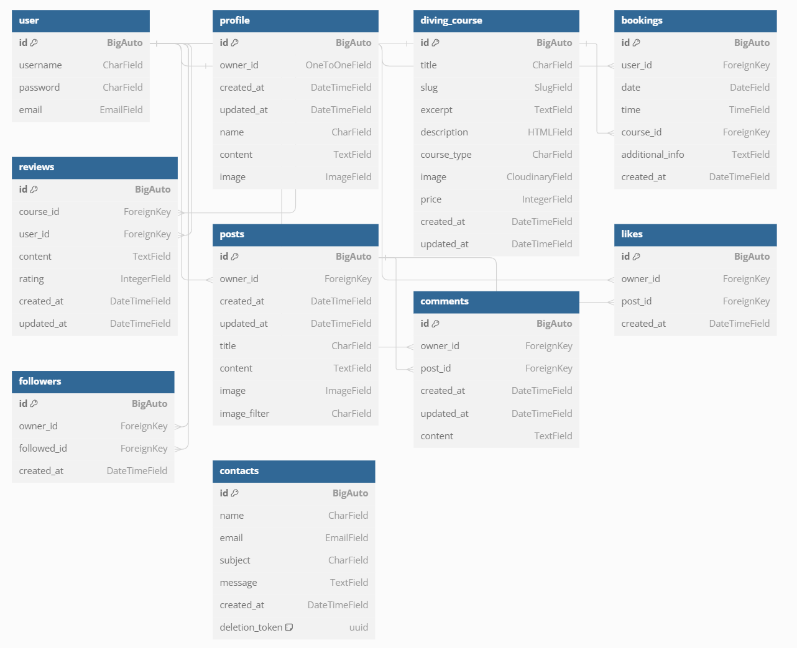

<p align="center">
  
</p>
<h1 align="center">Diving Center API - Django Rest Framework</h1>

[Diving Center Django Rest Framework API Backend Live Link](https://pp5api-divingspace-f0baea7c564e.herokuapp.com/)

[Diving Center React Frontend Live Link](https://divingspace-900b5a3db777.herokuapp.com/)

[Diving Center React Frontend Github Repo](https://github.com/AmirShkolnik/DivingCenter)

## Project Goals

### Diving Center - A Community for Scuba Enthusiasts

* **Build a thriving online community:** Foster a welcoming space for scuba divers of all levels to connect, share experiences, and learn from each other. [Click to watch the diving center home page](https://divingspace-900b5a3db777.herokuapp.com/courses)

* **Simplify course booking and management:** Allow divers to easily browse and book diving courses directly through the platform. [Courses page](https://divingspace-900b5a3db777.herokuapp.com/courses) ; [Course review and rating](https://divingspace-900b5a3db777.herokuapp.com/courses/advanced-open-water-diver) ; [Contact form](https://divingspace-900b5a3db777.herokuapp.com/contactus)

* **Enhance learning and discovery:** Provide a platform for logged in members to share their diving experiences, reviews, and photos, enriching the knowledge base for the community.

* **Empower user interaction:**  Enable logged in members to follow each other, like and comment on posts, creating a dynamic and engaging social experience. [Click to watch users feed](https://divingspace-900b5a3db777.herokuapp.com/feed)

**Technology Stack:**

* **Django REST Framework (Backend):** A powerful Python web framework that provides a robust foundation for building APIs (Application Programming Interfaces). These APIs will handle data management and communication between the application's frontend and backend. [Diving Center Django Rest Framework API Backend Live Link](https://pp5api-divingspace-f0baea7c564e.herokuapp.com/)

* **React (Frontend):** A popular JavaScript library for building user interfaces. React allows for the creation of interactive and responsive web pages that adapt to different devices. [Diving Center React Frontend Live Link](https://divingspace-900b5a3db777.herokuapp.com/)

**Key functionalities:**

* **User Management:**  Support for both regular users and admin accounts.

* **Course Management:**  Divers can view course information, book courses, and leave reviews. 

* **Content Sharing:**  Divers can create posts, share images, and interact with each other's content through likes, comments, and follows.

* **Admin Panel:**  Admins can manage user accounts, courses, and website content.

This combination of technologies empowers a feature-rich and interactive online platform catering to the needs of scuba diving enthusiasts.

[Visit Our Diving Center Website](https://divingspace-900b5a3db777.herokuapp.com/)

## Table of contents
- [Project Goals](#project-goals)
- [Table of contents](#table-of-contents)
- [Planning](#planning)
- [Data Models](#data-models)
- [API Endpoints](#api-endpoints)
- [Frameworks, Libraries, and Dependencies](#frameworks-libraries-and-dependencies)
- [Testing and Validation](#testing-and-validation)
- [Bugs](#bugs)
- [Deployment](#deployment)
- [Cloning and Forking](#cloning-and-forking)
- [Credits](#credits)
- [Acknowledgements](#acknowledgements)

Based on the information provided and the structure you've requested, here's a robust project planning for your diving center project, covering both backend and frontend development over an 8-week period:

## Planning

### Project Overview

This project is a comprehensive web application for a diving center. It allows users to view diving courses, book courses, leave reviews, and interact with a community of divers. The application will have a Django backend with a REST API, and a React frontend. Key features include user authentication, course management, booking system, review system, and a community feed.

### Objectives

1. Develop a secure and scalable backend API using Django and Django REST Framework.
2. Create an intuitive and responsive frontend using React.
3. Implement user authentication and authorization.
4. Develop a course management system with detailed course pages.
5. Create a booking system for users to reserve courses.
6. Implement a review system for courses.
7. Develop a community feed for user interactions.
8. Ensure the application is responsive and works well on various devices.

### Timeline

#### Week 1: Project Setup and Backend Foundations
- Day 1-2: Project initialization, environment setup
- Day 3-4: Database design, create Django models (User, Course, Booking, Review)
- Day 5: Set up Django REST Framework, create basic API views

#### Week 2: Backend Development - Core Features
- Day 1-2: Implement user authentication (registration, login, logout)
- Day 3-4: Develop course API endpoints (list, detail, create, update, delete)
- Day 5: Create booking system API endpoints

#### Week 3: Backend Development - Advanced Features
- Day 1-2: Implement review system API endpoints
- Day 3-4: Develop community feed API endpoints
- Day 5: Add filtering, pagination, and search functionality to API

#### Week 4: Backend Finalization and Frontend Setup
- Day 1-2: Backend testing and bug fixes
- Day 3: API documentation
- Day 4-5: Set up React project, implement routing, create basic components

#### Week 5: Frontend Development - Core Features
- Day 1-2: Implement user authentication on frontend
- Day 3-4: Develop course listing and detail pages
- Day 5: Create booking form and integration with API

#### Week 6: Frontend Development - Advanced Features
- Day 1-2: Implement review system on frontend
- Day 3-4: Develop community feed components
- Day 5: Add search and filtering functionality on frontend

#### Week 7: Frontend Styling and Responsiveness
- Day 1-2: Implement responsive design
- Day 3-4: Style components and pages
- Day 5: Implement loading states and error handling

#### Week 8: Testing, Optimization, and Deployment
- Day 1-2: Comprehensive testing (unit tests, integration tests)
- Day 3: Performance optimization (backend and frontend)
- Day 4: Prepare for deployment (configuration, environment variables)
- Day 5: Deploy application, final testing in production environment

This timeline provides a structured approach to develop the diving center application over 8 weeks. It covers all major aspects of both backend and frontend development, from initial setup to final deployment. This schedule might change during development as some tasks may take more or less time than anticipated.

[Back to top](#table-of-contents)

## Data Models

The data models for this diving center application represent a comprehensive and interconnected system designed to manage users, courses, bookings, reviews, social interactions, and customer inquiries. These models form the backbone of a feature-rich platform that caters to both the operational needs of a diving center and the social aspects of a diver community.

**Database Schema**

The database schema is carefully crafted to ensure efficient data storage, retrieval, and relationships between various entities. It utilizes Django's ORM (Object-Relational Mapping) to create a robust and scalable database structure. The schema incorporates both built-in Django models and custom-designed models to meet the specific requirements of the diving center application.

**Entity Relationship Diagram (ERD)**

The ERD visually represents the complex relationships between different entities in the system. It illustrates how users interact with courses, bookings, and reviews, as well as how social features like posts, comments, likes, and followers are interconnected. This diagram serves as a crucial tool for understanding the data flow and dependencies within the application.



**Technical Architecture**

Technical Design: The application follows a modular design approach, separating concerns into distinct models. This design facilitates easier maintenance, scalability, and future enhancements. The use of Django's built-in User model as a foundation ensures robust authentication and authorization mechanisms.

Model-Based Design: Each model is designed to encapsulate specific functionalities and data related to a particular aspect of the application. This approach allows for clear separation of concerns and promotes code reusability.

Relational Data Modeling: The database design leverages relational modeling techniques to establish connections between different entities. Foreign key relationships are used extensively to maintain data integrity and enable efficient querying across related data sets.

**Tables Overview**

The database consists of several interconnected tables, each serving a specific purpose in the application:

1. User: Manages user authentication and basic information.
2. Profile: Extends user information with additional details and preferences.
3. DivingCourse: Stores information about available diving courses.
4. Booking: Handles course reservations made by users.
5. Review: Allows users to rate and review courses.
6. Post: Manages user-generated content for the community feed.
7. Comment: Enables users to comment on posts.
8. Like: Tracks user likes on posts.
9. Follower: Manages user follow relationships.
10. Contact: Stores customer inquiries and messages.

**Relationships**

The relationships between these models create a cohesive system:

- Users are linked to Profiles, Bookings, Reviews, Posts, Comments, Likes, and Followers.
- DivingCourses are connected to Bookings and Reviews.
- Posts are associated with Comments and Likes.
- Followers establish connections between users.

These relationships enable complex queries and data retrieval, supporting features like personalized feeds, course recommendations, and social interactions.

Here's a Relationships table describing the connections between the various models:

| Relationship Type | Primary Model | Related Model | Description |
|-------------------|---------------|---------------|-------------|
| One-to-One | User | Profile | Each user has one profile |
| One-to-Many | User | Booking | One user can make many bookings |
| One-to-Many | DivingCourse | Booking | One diving course can have many bookings |
| One-to-Many | DivingCourse | Review | One diving course can have many reviews |
| One-to-Many | User | Review | One user can write many reviews |
| One-to-Many | User | Post | One user can create many posts |
| One-to-Many | User | Comment | One user can write many comments |
| One-to-Many | Post | Comment | One post can have many comments |
| One-to-Many | User | Like | One user can like many posts |
| One-to-Many | Post | Like | One post can have many likes |
| Many-to-Many | User | User | Users can follow many users (through Follower model) |
| One-to-Many | User | Contact | One user can submit many contact messages |

This table outlines the key relationships between the models in the diving center application, showing how different entities are connected and interact within the system.

### User Model

The User model serves as the central entity for authentication and user management. It utilizes Django's built-in User model, providing a solid foundation for user-related functionalities.

**Fields**:
- id: Unique identifier for each user
- username: Unique username for login
- password: Securely hashed password
- email: User's email address for communication

### Profile Model

The Profile model extends the User model with additional information, creating a more comprehensive user profile.

**Fields**:
- id: Unique identifier for each profile
- owner_id: One-to-one relationship with User model
- created_at: Timestamp of profile creation
- updated_at: Timestamp of last profile update
- name: User's full name
- content: Biographical information or user description
- image: Profile picture

### DivingCourse Model

This model represents the diving courses offered by the center, containing all relevant course information.

**Fields**:
- id: Unique identifier for each course
- title: Course title
- slug: URL-friendly version of the title
- excerpt: Brief description of the course
- description: Detailed course description (HTML-enabled)
- course_type: Type or category of the course
- image: Course image stored in Cloudinary
- price: Course price
- created_at: Timestamp of course creation
- updated_at: Timestamp of last course update

### Booking Model

The Booking model manages course reservations made by users.

**Fields**:
- id: Unique identifier for each booking
- user_id: Foreign key to User model
- date: Date of the booked course
- time: Time of the booked course
- course_id: Foreign key to DivingCourse model
- additional_info: Any extra information provided by the user
- created_at: Timestamp of booking creation

### Review Model

This model allows users to rate and review courses they've taken.

**Fields**:
- id: Unique identifier for each review
- course_id: Foreign key to DivingCourse model
- user_id: Foreign key to User model
- content: Text content of the review
- rating: Numerical rating given by the user
- created_at: Timestamp of review creation
- updated_at: Timestamp of last review update

### Post Model

The Post model manages user-generated content for the community feed.

**Fields**:
- id: Unique identifier for each post
- owner_id: Foreign key to User model
- created_at: Timestamp of post creation
- updated_at: Timestamp of last post update
- title: Post title
- content: Main content of the post
- image: Image associated with the post
- image_filter: Applied image filter (if any)

### Comment Model

This model allows users to comment on posts, fostering community interaction.

**Fields**:
- id: Unique identifier for each comment
- owner_id: Foreign key to User model
- post_id: Foreign key to Post model
- created_at: Timestamp of comment creation
- updated_at: Timestamp of last comment update
- content: Text content of the comment

### Like Model

The Like model tracks user likes on posts, enhancing social engagement.

**Fields**:
- id: Unique identifier for each like
- owner_id: Foreign key to User model
- post_id: Foreign key to Post model
- created_at: Timestamp of like creation

### Follower Model

This model manages user follow relationships, enabling social connections.

**Fields**:
- id: Unique identifier for each follower relationship
- owner_id: Foreign key to User model (follower)
- followed_id: Foreign key to User model (followed user)
- created_at: Timestamp of follow relationship creation

### Contact Model

The Contact model stores customer inquiries and messages.

**Fields**:
- id: Unique identifier for each contact message
- name: Name of the person making the inquiry
- email: Email address for correspondence
- subject: Subject of the inquiry
- message: Detailed message content
- created_at: Timestamp of message creation

[Back to top](#table-of-contents)

## API Endpoints

This table provides a comprehensive overview of all the API endpoints in the diving center project, including their HTTP methods, CRUD operations, view types, and descriptions. It covers all the major functionalities such as user authentication, profiles, posts, comments, likes, followers, bookings, contact messages, courses, and reviews.

| Model | Endpoint | HTTP Method | CRUD Operation | View Type | Description |
|-------|----------|-------------|----------------|-----------|-------------|
| **Root** |
| | `/` | GET | Read | Function-based view | Root route, welcomes to the Diving Center API |
| **Authentication** |
| | `/admin/` | GET | Read | Django Admin | Django admin interface |
| | `/dj-rest-auth/logout/` | POST | Delete | Function-based view | Custom logout route |
| | `/dj-rest-auth/login/` | POST | Create | DRF built-in view | User login |
| | `/dj-rest-auth/user/` | GET | Read | DRF built-in view | Get current user details |
| | `/dj-rest-auth/registration/` | POST | Create | DRF built-in view | User registration |
| **Profile** |
| | `/profiles/` | GET | Read | ListAPIView | List all profiles |
| | `/profiles/{id}/` | GET | Read | RetrieveUpdateAPIView | Retrieve a specific profile |
| | `/profiles/{id}/` | PUT/PATCH | Update | RetrieveUpdateAPIView | Update a specific profile (owner only) |
| **Post** |
| | `/posts/` | GET | Read | ListCreateAPIView | List all posts |
| | `/posts/` | POST | Create | ListCreateAPIView | Create a new post (authenticated users only) |
| | `/posts/{id}/` | GET | Read | RetrieveUpdateDestroyAPIView | Retrieve a specific post |
| | `/posts/{id}/` | PUT/PATCH | Update | RetrieveUpdateDestroyAPIView | Update a specific post (owner only) |
| | `/posts/{id}/` | DELETE | Delete | RetrieveUpdateDestroyAPIView | Delete a specific post (owner only) |
| **Comment** |
| | `/comments/` | GET | Read | ListCreateAPIView | List all comments |
| | `/comments/` | POST | Create | ListCreateAPIView | Create a new comment (authenticated users only) |
| | `/comments/{id}/` | GET | Read | RetrieveUpdateDestroyAPIView | Retrieve a specific comment |
| | `/comments/{id}/` | PUT/PATCH | Update | RetrieveUpdateDestroyAPIView | Update a specific comment (owner only) |
| | `/comments/{id}/` | DELETE | Delete | RetrieveUpdateDestroyAPIView | Delete a specific comment (owner only) |
| **Like** |
| | `/likes/` | GET | Read | ListCreateAPIView | List all likes |
| | `/likes/` | POST | Create | ListCreateAPIView | Create a new like (authenticated users only) |
| | `/likes/{id}/` | GET | Read | RetrieveDestroyAPIView | Retrieve a specific like |
| | `/likes/{id}/` | DELETE | Delete | RetrieveDestroyAPIView | Delete a specific like (owner only) |
| **Follower** |
| | `/followers/` | GET | Read | ListCreateAPIView | List all follower relationships |
| | `/followers/` | POST | Create | ListCreateAPIView | Create a new follower relationship (authenticated users only) |
| | `/followers/{id}/` | GET | Read | RetrieveDestroyAPIView | Retrieve a specific follower relationship |
| | `/followers/{id}/` | DELETE | Delete | RetrieveDestroyAPIView | Delete a specific follower relationship (owner only) |
| **Booking** |
| | `/bookings/` | GET | Read | ModelViewSet | List all bookings for the authenticated user |
| | `/bookings/` | POST | Create | ModelViewSet | Create a new booking (authenticated users only) |
| | `/bookings/{id}/` | GET | Read | ModelViewSet | Retrieve a specific booking |
| | `/bookings/{id}/` | PUT/PATCH | Update | ModelViewSet | Update a specific booking (owner only) |
| | `/bookings/{id}/` | DELETE | Delete | ModelViewSet | Delete a specific booking (owner only) |
| **Contact** |
| | `/contactus/` | POST | Create | APIView | Create a new contact message |
| | `/contactus/{id}/` | PUT | Update | APIView | Update an existing contact message |
| | `/contactus/{id}/delete/` | DELETE | Delete | Function-based view | Delete a specific contact message |
| **Course** |
| | `/courses/` | GET | Read | ModelViewSet | List all courses |
| | `/courses/` | POST | Create | ModelViewSet | Create a new course (admin only) |
| | `/courses/{slug}/` | GET | Read | ModelViewSet | Retrieve a specific course |
| | `/courses/{slug}/` | PUT/PATCH | Update | ModelViewSet | Update a specific course (admin only) |
| | `/courses/{slug}/` | DELETE | Delete | ModelViewSet | Delete a specific course (admin only) |
| **Review** |
| | `/reviews/` | GET | Read | ModelViewSet | List all reviews |
| | `/reviews/` | POST | Create | ModelViewSet | Create a new review (authenticated users only) |
| | `/reviews/{id}/` | GET | Read | ModelViewSet | Retrieve a specific review |
| | `/reviews/{id}/` | PUT/PATCH | Update | ModelViewSet | Update a specific review (owner only) |
| | `/reviews/{id}/` | DELETE | Delete | ModelViewSet | Delete a specific review (owner only) |

[Back to top](#table-of-contents)

## Frameworks, Libraries, and Dependencies

The Diving Center project leverages a variety of frameworks, libraries, and dependencies to ensure robust functionality and performance. Below is a detailed list of the key components used:

### Django Framework and Extensions

1. **Django** (`Django==5.0.6`):
   - A high-level Python web framework that encourages rapid development and clean, pragmatic design. Django handles much of the complexity of web development, allowing developers to focus on writing their app without needing to reinvent the wheel.

2. **Django REST Framework** (`djangorestframework==3.15.1`):
   - A powerful and flexible toolkit for building Web APIs in Django. It provides various features such as serialization, authentication, and view sets that simplify API development.

3. **Django Allauth** (`django-allauth==0.54.0`):
   - Integrated set of Django applications addressing authentication, registration, account management as well as 3rd party (social) account authentication.

4. **Django REST Auth** (`dj-rest-auth==2.1.9`):
   - Provides a set of REST API endpoints for handling user registration and authentication tasks. It’s built on top of Django Allauth and Django REST Framework.

5. **Django Filter** (`django-filter==24.2`):
   - Simplifies the process of filtering querysets in Django REST Framework.

6. **Django CORS Headers** (`django-cors-headers==4.3.1`):
   - A Django app for handling the server headers required for Cross-Origin Resource Sharing (CORS).

### Database Management

7. **dj-database-url** (`dj-database-url==0.5.0`):
   - Allows you to utilize the DATABASE_URL environment variable to configure your Django application.

8. **psycopg2** (`psycopg2==2.9.9`):
   - PostgreSQL database adapter for Python.

### Authentication and Security

9. **djangorestframework-simplejwt** (`djangorestframework-simplejwt==5.3.1`):
   - Provides JSON Web Token (JWT) authentication for Django REST Framework.

10. **oauthlib** (`oauthlib==3.2.2`):
    - A generic, spec-compliant, thorough implementation of the OAuth request-signing logic for Python.

11. **requests-oauthlib** (`requests-oauthlib==2.0.0`):
    - OAuthlib support for Python-Requests, the ubiquitous HTTP library for Python.

12. **PyJWT** (`PyJWT==2.8.0`):
    - A Python library which allows you to encode and decode JSON Web Tokens (JWT).

### Storage and Image Handling

13. **Pillow** (`Pillow==10.3.0`):
    - Python Imaging Library (PIL) fork that supports opening, manipulating, and saving many different image file formats.

14. **Cloudinary** (`cloudinary==1.40.0`):
    - A library that integrates your application with the Cloudinary service for managing media assets such as images and videos.

15. **django-cloudinary-storage** (`django-cloudinary-storage==0.3.0`):
    - Facilitates the integration of Django with Cloudinary for storing media files.

### Miscellaneous

16. **asgiref** (`asgiref==3.8.1`):
    - ASGI specification and utilities, used by Django for asynchronous support.

17. **django-js-asset** (`django-js-asset==2.2.0`):
    - A Django app that provides a template tag for loading JavaScript assets.

18. **django-tinymce** (`django-tinymce==4.1.0`):
    - A Django application that provides a fully integrated TinyMCE WYSIWYG editor.

19. **pytz** (`pytz==2024.1`):
    - World timezone definitions for Python, allowing accurate and cross-platform timezone calculations.

20. **sqlparse** (`sqlparse==0.5.0`):
    - A non-validating SQL parser for Python. It provides support for parsing, splitting, and formatting SQL statements.

21. **gunicorn** (`gunicorn==22.0.0`):
    - A Python WSGI HTTP Server for UNIX, used to serve Django applications in production.

[Back to top](#table-of-contents)

## Testing and Validation

For all testing and validation, please refer to the [TESTING.md](TESTING.md) file.

## Bugs

### Solved Bugs

### Known Bugs

### Unknown Bugs

I am not aware of any remaining bugs.

# Deployment

The "Diving Center" project leverages a combination of platforms and services to facilitate its deployment and management.

For hosting and running the application, Heroku, a cloud platform as a service (PaaS), is utilized. It enables seamless deployment, automatic scaling, and management tools for monitoring and maintaining the application. The Code Institute (CI) database systems are employed to store and manage the application's data during development and deployment phases.

Additionally, Cloudinary, a cloud-based service, is integrated to handle image and video management, providing an end-to-end solution for storing, optimizing, and delivering media assets for the "Diving Center" platform.
The respective URLs for these platforms and services are as follows:

## GitHub
- **Repository Setup:** GitHub serves as the version control system, hosting the project's codebase and enabling collaboration among developers.
[GitHub](https://github.com)

## Gitpod
- **Development Environment:** Gitpod, a cloud-based integrated development environment (IDE), provides a streamlined coding experience by offering a preconfigured workspace with all the necessary tools and dependencies. [Gitpod](https://www.gitpod.io/)

## Heroku
- **Application Hosting:** For hosting and running the application, Heroku, a cloud platform as a service (PaaS), is utilized. It enables seamless deployment, automatic scaling, and management tools for monitoring and maintaining the application.
[Heroku](https://www.heroku.com)
  - **Setting up on Heroku:**
Here's a simplified 10-step explanation on how to use Heroku's cloud server to deploy your "Diving Center" project, written in easy-to-understand language for non-coders:

1. **Sign up for Heroku**: Go to heroku.com and create an account.

2. **Create a new app**: After logging in, click on the "New" button in the top right corner and select "Create New App". Give your app a unique name and choose your preferred region.

3. **Connect to GitHub**: In the "Deploy" section, select "GitHub" as the deployment method. Search for your "Diving Center" repository and connect it to Heroku.

4. **Set up environment variables**: In the "Settings" section, click on "Reveal Config Vars". Here, you'll need to add some important variables:
   - `SECRET_KEY`: A secret key for your Django project (you can generate one online).
   - `DATABASE_URL`: The URL for your database (e.g., Heroku Postgres).
   - `CLOUDINARY_URL`: The URL for your Cloudinary account (for storing images and media).

5. **Enable automatic deploys**: In the "Deploy" section, you can choose to enable automatic deploys from your GitHub repository. This means Heroku will automatically update your app whenever you push new changes to GitHub.

6. **Deploy your app**: If you didn't enable automatic deploys, you can manually deploy your app by scrolling down to the "Manual Deploy" section and clicking "Deploy Branch".

7. **Open your app**: After a successful deployment, Heroku will provide you with a unique URL where your "Diving Center" app is now live! You can click the "View" button to open it.

8. **Set up a database**: If your app requires a database, you'll need to provision one. Heroku recommends using Heroku Postgres, which you can set up through the "Resources" section of your app's dashboard.

9. **Update your code**: If you need to make changes to your app, simply commit and push the updates to your GitHub repository. If you enabled automatic deploys, Heroku will automatically update your live app. Otherwise, you'll need to manually re-deploy.

10. **Monitor your app**: Heroku provides tools to monitor your app's performance, logs, and other metrics. You can access these through the "More" menu in your app's dashboard.

By following these steps, you'll be able to deploy your "Diving Center" project to Heroku's cloud server, making it accessible to anyone with the app's URL. Remember to consult Heroku's documentation or seek help if you encounter any issues during the deployment process.

Citations:
[1] https://developer.mozilla.org/en-US/docs/Web/JavaScript
[2] https://developer.mozilla.org/en-US/docs/Web/CSS
[3] https://developer.mozilla.org/en-US/docs/Web/Guide/HTML/HTML5
[4] https://devcenter.heroku.com/articles/preparing-a-codebase-for-heroku-deployment
[5] https://coding-boot-camp.github.io/full-stack/heroku/heroku-deployment-guide/

**For deployment Heroku needs two additional files in order to deploy properly.**
- requirements.txt
- Procfile
  
You can install this project's requirements (where applicable) using:

- **pip3 install -r requirements.txt**

If you have your own packages that have been installed, then the requirements file needs updated using:

- **pip3 freeze --local > requirements.txt**

**The Procfile can be created with the following command:**

echo web: gunicorn app_name.wsgi > Procfile
replace app_name with the name of your primary Django app name; the folder where settings.py is located

## CI database
- **Database Hosting:** The Code Institute (CI) provides PostgreSQL-based database systems specifically for students to use during the development and deployment phases of their projects. PostgreSQL, known for its robustness and reliability, is an advanced, open-source relational database system. It is well-suited for handling complex queries and large volumes of data, making it an excellent choice for web applications.

- **Development Phase:** During development, the CI database allows students to efficiently store, retrieve, and manipulate data required for their applications. It supports various data types and advanced features such as indexing, transactions, and concurrency control, ensuring smooth and effective development processes.

- **Deployment Phase:** When it comes to deployment, the CI database continues to serve as a reliable backend for the application. Students can leverage the database’s capabilities to manage user data, application state, and other critical information with high availability and performance.

- **Accessibility:** The CI database systems are accessible to Code Institute students, providing a consistent and stable environment for learning and project development. This ensures that students have a standardized platform to practice and implement database management techniques, which are crucial skills in the field of web development.

- **Integration:** The PostgreSQL databases provided by CI can be seamlessly integrated with various web frameworks and technologies taught in the course, such as Django. This integration enables students to implement real-world applications with database-driven functionality.

## Cloudinary

To enhance performance and scalability, the project utilizes a third-party service for hosting and serving static media files like images. This approach alleviates the burden on the primary hosting platform, ensuring efficient delivery of content to users. 

- **Media Storage:** Cloudinary is used for hosting media files like images. It removes the load of serving static files from Heroku, ensuring better performance and scalability. [Cloudinary](https://cloudinary.com/)
  - **Integration:**
    1. Set up a Cloudinary account.
    2. Configure the Cloudinary settings in the Django settings file with the API keys provided by Cloudinary.
    3. Use Django’s storage backend for Cloudinary to handle media uploads.

By adopting this approach, the project benefits from a dedicated and optimized infrastructure for managing and delivering static media content. This not only improves the overall user experience but also facilitates future growth and expansion by providing a scalable solution for handling an increasing volume of media assets.

# Cloning and Forking

## Cloning the Repository
- **Local Setup:**
  1. Clone the repository: [GitHub repository](https://github.com/AmirShkolnik/Cups-of-Joy). 
 `git clone https://github.com/AmirShkolnik/Cups-of-Joy`.
  2. Navigate into the project directory: `cd software-stacks-p4`
  3. Install dependencies: `pip install -r requirements.txt`
  4. Set up local environment variables in a `.env` file.
  5. Run migrations: `python manage.py migrate`
  6. Start the development server: `python manage.py runserver`

1. **Open Your Preferred Code Editor**: Launch the code editor or integrated development environment (IDE) you typically use for your coding projects.

2. **Navigate to the Repository URL**: Visit the following URL in your web browser: https://github.com/AmirShkolnik/Cups-of-Joy

3. **Locate the Clone Button**: On the repository page, you'll find a green-colored button labeled "Code". Click on this button to reveal the cloning options.

4. **Copy the Repository URL**: Depending on your preferred cloning method, copy the repository URL provided. You can choose either the HTTPS, SSH URL or GitHub CLI based on your setup and preferences.

5. **Open a Terminal or Command Prompt**: In your code editor or operating system, open a terminal or command prompt window. This will allow you to execute Git commands.

6. **Navigate to Your Desired Directory**: Using the terminal or command prompt, navigate to the directory or folder where you want to clone the "Diving Center" repository. You can use the `cd` command followed by the path to change directories.

7. **Execute the Clone Command**: Once you're in the desired directory, execute the following Git command, replacing `<repository_url>` with the URL you copied earlier:

   ```
   git clone <repository_url>
   ```

   Press Enter, and Git will start cloning the repository to your local machine.

8. **Install requirements**: Install requirements from requirements.txt using the command "pip install -r requirements.txt". If working in a virtual environment, activate the virtual environment before running the command.

9. **Create env.py**: Create a env.py to store database url, secret key and cloudinary url. directory:

## Forking the Repository

Here's an original step-by-step guide for forking the "Diving Center" project from the GitHub repository located at https://github.com/AmirShkolnik/Cups-of-Joy:

1. **Navigate to the Repository**: Open your web browser and visit the "Diving Center" repository at https://github.com/AmirShkolnik/Cups-of-Joy.

2. **Locate the Fork Button**: On the top-right corner of the repository page, you'll find a button labeled "Fork". This button allows you to create a copy of the repository under your own GitHub account.

3. **Create Your Fork**: Click on the "Fork" button. GitHub will prompt you to select the destination account for your forked repository. Choose your personal GitHub account or an organization you have access to. click the green button "Create fork". 

4. **Wait for the Forking Process**: GitHub will initiate the forking process, creating a complete copy of the "Diving Center" repository under your chosen account or organization. This process may take a few moments, depending on the size of the repository.

5. **Navigate to Your Forked Repository**: Once the forking process is complete, you'll be automatically redirected to the forked repository's page within your account or organization. The URL will reflect the new location of your forked repository.

6. **Customize Your Fork (Optional)**: You now have full control over your forked repository. You can rename it, modify the description, or make any other desired changes to distinguish it from the original repository.

## Credits

### Code

The development of the Fit and Fine application was supported by various resources and contributions from the community. Here are the key references and sources of inspiration for the Fit and Fine project:

- The technique to limit the size of image uploads to Cloudinary is adapted from this [Cloudinary Support Article](https://support.cloudinary.com/hc/en-us/community/posts/360009752479-How-to-resize-before-uploading-pictures-in-Django).
- A replacement for the deprecated `django.conf.urls.url()` was implemented as per this [StackOverflow Article](https://stackoverflow.com/questions/70319606/importerror-cannot-import-name-url-from-django-conf-urls-after-upgrading-to).
- How to access URL arguments as kwargs in generic APIViews is from this [StackOverflow Article](https://stackoverflow.com/questions/51042871/how-to-access-url-kwargs-in-generic-api-views-listcreateapiview-to-be-more-spec).
- The fix for the Django Rest Framework bug that prevents user's cookies from being cleared on logout is from the Code Institute Django Rest Framework walkthrough project.
- The technique for overriding the `to_representation` method of a serializer to make a change to the outgoing JSON data used in `profiles/serializers.py` is from this [testdriven.io Tip](https://testdriven.io/tips/ed79fa08-6834-4827-b00d-2609205129e0/).
- The method to set up user authentication with JWT in Django Rest Framework is adapted from this [StackOverflow Article](https://stackoverflow.com/questions/44697872/django-rest-framework-jwt-user-login).
- The technique to handle file uploads in Django Rest Framework is from this [StackOverflow Article](https://stackoverflow.com/questions/45232352/file-upload-with-django-rest-framework).
- The method to test Django Rest Framework endpoints using the APIClient is adapted from this [Django Rest Framework Documentation](https://www.django-rest-framework.org/api-guide/testing/).

In addition, the following documentation was extensively referenced throughout development:

- [Django Documentation](https://www.djangoproject.com)
- [Django Rest Framework Documentation](https://www.django-rest-framework.org)
- [django-filter Documentation](https://django-filter.readthedocs.io/en/stable/)
- [django-recurrence Documentation](https://django-recurrence.readthedocs.io/en/latest/)
- [Python datetime Documentation](https://docs.python.org/3/library/datetime.html)
- [dateutil Documentation](https://dateutil.readthedocs.io/en/stable/index.html)
- [Django Rest Framework JWT Documentation](https://jpadilla.github.io/django-rest-framework-jwt/)

These resources provided invaluable insights and guidance, significantly contributing to the successful development of the Fit and Fine DRF API application.

### Media

The following sites were used to gather the photographic media used:
- [Freepik](https://www.freepik.com/)

[Back to top](#table-of-contents)

## Acknowledgements

The development of Diving Center has been an exciting journey, and I am grateful for the inspiration, guidance, and resources that have contributed to the project. 

### Inspiration
- **Strava**: The idea for Diving Center was inspired by [Strava](https://www.strava.com/), a leading platform for fitness enthusiasts to track their activities, compete with others, and share their fitness journeys. Strava's robust features and community-centric approach motivated me to create a similar platform focused on comprehensive fitness tracking and community engagement.

### Project Guidance
**Moments DJANGO REST DRF API and Moments REACT Walkthrough Project** I utilized the Moments Walkthrough Project as a foundational guide. This project provided valuable insights into structuring the application, implementing various features, and ensuring a seamless user experience.
The Moments project had several ideas and functionalities similar to what I envisioned for Diving Center, which helped streamline my development process.


### Personal Thanks
- Many thanks to **my husband** for his incredible support and encouragement throughout this journey.
- My heartfelt gratitude to **my son**, who is 18 months old, for bringing joy and motivation into my life.
- Thanks to **Kristyna, Cohort facilitator** at Code Institute, for always being there to provide all the information needed and for keeping the positive energy up.
- Thanks to  my Code Institute **mentor** and my **fellow students** for constantly inspiring me on Slack and being there for each other to help in times of trouble.

[Back to top](#table-of-contents)