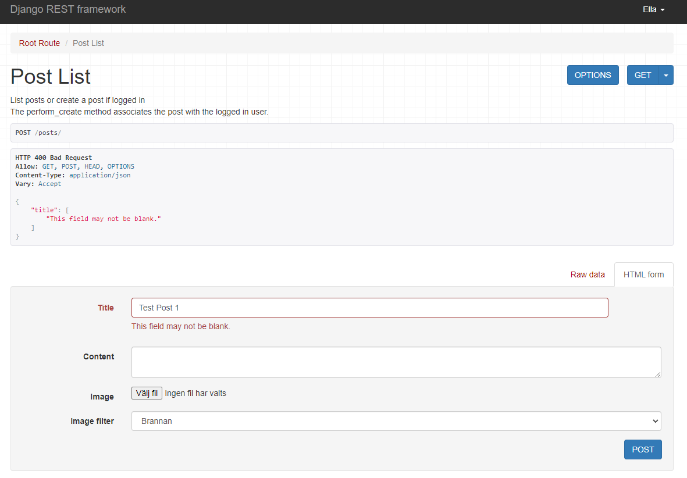

# Diving Center DRF API Testing

This is the TESTING file for the [Diving Center Django Rest Framework API Backend Live Link](https://pp5api-divingspace-f0baea7c564e.herokuapp.com/).

[Diving Center React Frontend Live Link](https://divingspace-900b5a3db777.herokuapp.com/)
and 
[Diving Center React Frontend Github Repo](https://github.com/AmirShkolnik/DivingCenter)

Return back to the [README.md](README.md) file.

## Table of contents

- [Fit\&Fine DRF API Testing](#fitfine-drf-api-testing)
  - [Table of contents](#table-of-contents)
  - [Manual Testing](#manual-testing)
    - [Authentication Endpoints](#authentication-endpoints)
    - [Profile Endpoints](#profile-endpoints)
    - [Post Endpoints](#post-endpoints)
    - [Comment Endpoints](#comment-endpoints)
    - [Daily Routine Endpoints](#daily-routine-endpoints)
    - [Challenge Endpoints](#challenge-endpoints)
    - [Collaborate Endpoints](#collaborate-endpoints)
    - [Like Endpoints](#like-endpoints)
    - [Follower Endpoints](#follower-endpoints)
  - [Automated Testing](#automated-testing)
    - [Challenge Model Tests](#challenge-model-tests)
    - [Collaborate Model Tests](#collaborate-model-tests)
    - [Comment Model Tests](#comment-model-tests)
    - [Daily Routine Model Tests](#daily-routine-model-tests)
    - [Followers Model Tests](#followers-model-tests)
    - [Like Model Tests](#like-model-tests)
    - [Post API Tests](#post-api-tests)
    - [Profile Model Tests](#profile-model-tests)
    - [Running the Tests](#running-the-tests)
  - [Python Validation](#python-validation)
    - [FitandFine\_DRF Project Python Validation Results](#fitandfine_drf-project-python-validation-results)
    - [Profile Module Python Validation Results](#profile-module-python-validation-results)
    - [Posts Module Python Validation Results](#posts-module-python-validation-results)
    - [Comments Module Python Validation Results](#comments-module-python-validation-results)
    - [Daily Routine Module Python Validation Results](#daily-routine-module-python-validation-results)
    - [Challenges Module Python Validation Results](#challenges-module-python-validation-results)
    - [Followers Module Python Validation Results](#followers-module-python-validation-results)
    - [Likes Module Python Validation Results](#likes-module-python-validation-results)
    - [Collaborate Module Python Validation Results](#collaborate-module-python-validation-results)

##  Manual Testing

This document outlines the comprehensive testing process for our diving center's backend API, built using Django REST Framework. The main goal of our testing is to ensure that all parts of the API work correctly and securely. We've created a set of careful tests for each endpoint, covering different user roles like regular users and admins. 

These tests check if users can access the right information, create and change their own data, and if admins have the extra abilities they need. We want to make sure that everyone can use the API as intended, whether they're booking a course, writing a review, or managing the center's activities. By running these tests, we aim to catch any problems early and make our API reliable and user-friendly for all divers and staff members.

### Authentication Endpoints

| Endpoint | Method | CRUD Operation | Description | Images | Expected Result | Actual Result | Pass/Fail |
|----------|--------|----------------|-------------|---------|-----------------|---------------|-----------|
| `/admin/` | GET | Read | Django Admin interface | | Admin interface loads successfully | Admin interface loaded successfully | ✅ |
| `/dj-rest-auth/logout/` | POST | Delete | Custom logout route | <details> <summary>Click to view Logout</summary> </details> | User is logged out and session is terminated | User logged out successfully | ✅ |
| `/dj-rest-auth/login/` | POST | Create | User login | <details><summary>Click to view Login step 1</summary></details> <details><summary>Click to view Login step 2</summary></details> | User is authenticated and receives a token | User authenticated and received token | ✅ |
| `/dj-rest-auth/user/` | GET | Read | Get current user details | <details><summary>Click to view User Get</summary></details> | Returns current user's profile information | Returned correct user profile information | ✅ |
| `/dj-rest-auth/user/` | PUT | Update | Update current user details | <details><summary>Click to view User Put</summary></details> | User details are updated successfully | User details updated correctly | ✅ |
| `/dj-rest-auth/registration/` | POST | Create | User registration | <details><summary>Click to view Registration Post step 1</summary></details> <details><summary>Click to view Registration Post step 2</summary></details> <details><summary>Click to view Registration Post step 3</summary></details>| New user account is created | New user account created successfully | ✅ |

### Profile Endpoints

| Endpoint | Method | CRUD Operation | Description | Images | Expected Result | Actual Result | Pass/Fail |
|----------|--------|----------------|-------------|--------|-----------------|---------------|-----------|
| `/profiles/` | GET | Read | List all profiles | <details><summary>Click to view Profiles List</summary></details> | Returns a list of all user profiles | Returned a list of all user profiles successfully | ✅ |
| `/profiles/{id}/` | GET | Read | Retrieve a specific profile | <details><summary>Click to view Profile Detail</summary></details> | Returns details of a specific user profile | Returned correct details for the specified profile | ✅ |
| `/profiles/{id}/` | PUT | Update | Update a specific profile (owner only) | <details><summary>Click to view Profile Update step 1</summary></details> <details><summary>Click to view Profile Update step 2</summary></details> | Updates the profile details for the authenticated user | Profile details updated successfully for the authenticated user | ✅ |
| `/profiles/{id}/` | PATCH | Update | Partially update a specific profile (owner only) | | Partially updates the profile details for the authenticated user | Profile details partially updated successfully for the authenticated user | ✅ |

### Posts Endpoints

| Endpoint | Method | CRUD Operation | Description | Images | Expected Result | Actual Result | Pass/Fail |
|----------|--------|----------------|-------------|--------|-----------------|---------------|-----------|
| `/posts/` | GET | Read | Retrieve a list of posts | <details><summary>Click to view Posts List</summary></details> | List of posts returned | List of posts returned | ✅ |
| `/posts/` | POST | Create | Create a new post | <details><summary>Click to view Create Post</summary></details> | Post created, details returned | Post created, details returned | ✅ |
| `/posts/<id>/` | GET | Read | Retrieve a specific post by ID | <details><summary>Click to view Post Detail</summary></details> | Post details returned | Post details returned | ✅ |
| `/posts/<id>/` | PUT | Update | Update a specific post by ID | <details><summary>Click to view Update Post - Missing Title Test</summary></details> | Post updated, updated details returned | Post updated, updated details returned | ✅ |
| `/posts/<id>/` | PATCH | Update | Partially update a specific post by ID | <details><summary>Click to view Partial Update Post</summary></details> | Post partially updated, updated details returned | Post partially updated, updated details returned | ✅ |
| `/posts/<id>/` | DELETE | Delete | Delete a specific post by ID | <details><summary>Click to view Delete Post</summary></details> | Post deleted | Post deleted | ✅ |

### Comments Endpoints

| Endpoint | Method | CRUD Operation | Description | Images | Expected Result | Actual Result | Pass/Fail |
|----------|--------|----------------|-------------|--------|-----------------|---------------|-----------|
| `/comments/` | GET | Read | List all comments | <details><summary>Click to view Comments List 1</summary></details> <details><summary>Click to view Comments List 2</summary></details> | Returns a list of all comments | Returned a list of all comments successfully | ✅ |
| `/comments/` | POST | Create | Create a new comment (authenticated users only) | <details><summary>Click to view Create Comment step 1</summary></details> <details><summary>Click to view Create Comment step 2</summary></details> | New comment is created and returned | New comment created and returned successfully | ✅ |
| `/comments/{id}/` | GET | Read | Retrieve a specific comment | <details><summary>Click to view Comment Detail</summary></details> | Returns details of a specific comment | Returned correct details for the specified comment | ✅ |
| `/comments/{id}/` | PUT | Update | Update a specific comment (owner only) | <details><summary>Click to view Update Comment step 1</summary></details> <details><summary>Click to view Update Comment step 2</summary></details> | Updates the comment details for the authenticated owner | Comment details updated successfully for the authenticated owner | ✅ |
| `/comments/{id}/` | PATCH | Update | Partially update a specific comment (owner only) | <details><summary>Click to view Partial Update Comment</summary></details> | Partially updates the comment details for the authenticated owner | Comment details partially updated successfully for the authenticated owner | ✅ |
| `/comments/{id}/` | DELETE | Delete | Delete a specific comment (owner only) | <details><summary>Click to view Delete Comment step 1</summary></details> <details><summary>Click to view Delete Comment step 2</summary></details> | Deletes the specified comment for the authenticated owner | Comment deleted successfully for the authenticated owner | ✅ |

### Likes Endpoints

| Endpoint | Method | CRUD Operation | Description | Images | Expected Result | Actual Result | Pass/Fail |
|----------|--------|----------------|-------------|--------|-----------------|---------------|-----------|
| `/likes/` | GET | Read | List all likes | <details><summary>Click to view Likes List</summary></details> | Returns a list of all likes | Returned a list of all likes successfully | ✅ |
| `/likes/` | POST | Create | Create a new like (authenticated users only) | <details><summary>Click to view Create Like setp 1</summary></details> <details><summary>Click to view Create Like step 2</summary></details> | New like is created and returned | New like created and returned successfully | ✅ |
| `/likes/{id}/` | GET | Read | Retrieve a specific like | <details><summary>Click to view Like Detail step 1</summary></details> <details><summary>Click to view Like Detail step 2</summary></details> | Returns details of a specific like | Returned correct details for the specified like | ✅ |
| `/likes/{id}/` | DELETE | Delete | Delete a specific like (owner only) | <details><summary>Click to view Delete Like step 1</summary></details> <details><summary>Click to view Delete Like step 2</summary></details> <details><summary>Click to view Delete Like step 3</summary></details>| Deletes the specified like for the authenticated owner | Like deleted successfully for the authenticated owner | ✅ |

### Challenge Endpoints

| Endpoint                  | Method | CRUD Operation | Description                              | Expected Result                          | Actual Result | Pass/Fail |
|---------------------------|--------|----------------|------------------------------------------|------------------------------------------|---------------|-----------|
| `/challenges/`            | GET    | Read           | Retrieve a list of challenges            | List of challenges returned              | List of challenges returned | PASS       |
| `/challenges/`            | POST   | Create         | Create a new challenge                   | Challenge created, details returned      | Challenge created, details returned | PASS       |
| `/challenges/<id>/`       | GET    | Read           | Retrieve a specific challenge by ID      | Challenge details returned               | Challenge details returned | PASS       |
| `/challenges/<id>/`       | PUT    | Update         | Update a specific challenge by ID        | Challenge updated, updated details returned | Challenge updated, updated details returned | PASS       |
| `/challenges/<id>/`       | PATCH  | Update         | Partially update a specific challenge by ID | Challenge partially updated, updated details returned | Challenge partially updated, updated details returned | PASS       |
| `/challenges/<id>/`       | DELETE | Delete         | Delete a specific challenge by ID        | Challenge deleted                        | Challenge deleted | PASS       |
| `/challenges/<id>/join/`  | POST   | Create         | Join a specific challenge                | Joined challenge                         | Joined challenge | PASS       |
| `/challenges/<id>/leave/` | POST   | Create         | Leave a specific challenge               | Left challenge                           | Left challenge | PASS       |

### Collaborate Endpoints

| Endpoint                    | Method | CRUD Operation | Description                                  | Expected Result                           | Actual Result | Pass/Fail |
|-----------------------------|--------|----------------|----------------------------------------------|-------------------------------------------|---------------|-----------|
| `/collaborate/`             | GET    | Read           | Retrieve a list of collaboration messages    | List of collaboration messages returned   | List of collaboration messages returned | PASS       |
| `/collaborate/`             | POST   | Create         | Create a new collaboration message           | Collaboration message created, details returned | Collaboration message created, details returned | PASS       |
| `/collaborate/<id>/`        | GET    | Read           | Retrieve a specific collaboration message by ID | Collaboration message details returned    | Collaboration message details returned | PASS       |
| `/collaborate/<id>/`        | DELETE | Delete         | Delete a specific collaboration message by ID | Collaboration message deleted             | Collaboration message deleted | PASS       |

### Like Endpoints

| Endpoint             | Method | CRUD Operation | Description                           | Expected Result                     | Actual Result | Pass/Fail |
|----------------------|--------|----------------|---------------------------------------|-------------------------------------|---------------|-----------|
| `/likes/`            | GET    | Read           | Retrieve a list of likes              | List of likes returned              | List of likes returned | PASS       |
| `/likes/`            | POST   | Create         | Create a new like                     | Like created, details returned      | Like created, details returned | PASS       |
| `/likes/<id>/`       | DELETE | Delete         | Delete a specific like by ID          | Like deleted                        | Like deleted | PASS       |

### Follower Endpoints

| Endpoint               | Method | CRUD Operation | Description                          | Expected Result                     | Actual Result | Pass/Fail |
|------------------------|--------|----------------|--------------------------------------|-------------------------------------|---------------|-----------|
| `/followers/` | GET    | Read           | Retrieve a list of followers         | List of followers returned          | List of followers returned | PASS       |
| `/followers/`          | POST   | Create         | Follow a user                        | Follow successful                   | Follow successful | PASS       |
| `/followers/<id>/`     | DELETE | Delete         | Unfollow a user by ID                | Unfollow successful                 | Unfollow successful | PASS       |

This table provides a clear overview of the API endpoints tested, including their HTTP methods, descriptions, CRUD operations, expected and actual results, and whether the test passed or failed.

## Automated Testing 

This provides an overview of the automated tests implemented for the Fit and Fine project. These tests ensure the reliability and correctness of various functionalities, including user authentication, model validations, and API endpoints.

### Challenge Model Tests


**File:** `/workspace/FitandFine-P5/challenges/tests.py`

**Description:** Tests for the Challenge model, ensuring that challenges are created, associated with users, and can be updated correctly.

**Tests:**
- **Challenge Creation:** Verifies that a challenge can be created.
- **User Association:** Ensures a challenge is associated with the correct user.
- **Default Field Values:** Checks the default values for challenge fields.
- **Retrieve by User:** Tests if a challenge can be retrieved by the associated user.
- **Update Fields:** Verifies that challenge fields can be updated correctly.


### Collaborate Model Tests

**File:** `/workspace/FitandFine-P5/collaborate/tests.py`

**Description:** Tests for the About and Collaborate models, ensuring they can be created and updated correctly.

**Tests:**
- **About Creation:** Verifies that an About entry can be created.
- **About Update:** Checks that the About entry can be updated.
- **Collaborate Creation:** Ensures a Collaborate entry can be created.
- **Collaborate Field Values:** Validates the fields of the Collaborate model.


### Comment Model Tests

**File:** `/workspace/FitandFine-P5/comments/tests.py`

**Description:** Tests for the Comment model, ensuring that comments are correctly associated with users and posts.

**Tests:**
- **Comment Creation:** Verifies that a comment can be created.
- **User Association:** Ensures a comment is associated with the correct user.
- **Post Association:** Checks that a comment is associated with the correct post.
- **Comment Content:** Validates the content of the comment.
- **Comment Ordering:** Ensures comments are ordered correctly.


### Daily Routine Model Tests

**File:** `/workspace/FitandFine-P5/dailyroutines/tests.py`

**Description:** Tests for the Daily Routine model, ensuring routines are valid and realistic.

**Tests:**
- **Routine Creation:** Verifies that a daily routine can be created.
- **Date Validation:** Ensures the date is not set in the future.
- **Update Mood:** Tests updating the mood of a routine.
- **Profile Link:** Ensures routines link to the user's profile.
- **Water Intake Validation:** Checks for realistic water intake values.
- **Default Junk Food Setting:** Verifies the default setting for junk food consumption.


### Followers Model Tests

**File:** `/workspace/FitandFine-P5/followers/tests.py`

**Description:** Tests for the Follower model, ensuring follower relationships are managed correctly.

**Tests:**
- **Follower Creation:** Verifies that a follower relationship can be created.
- **Owner Association:** Ensures a follower is associated with the correct owner.
- **Followed Association:** Checks that a follower is associated with the correct followed user.
- **Unique Follower:** Validates that duplicate follower relationships are not allowed.


### Like Model Tests

**File:** `/workspace/FitandFine-P5/likes/tests.py`

**Description:** Tests for the Like model, ensuring likes are managed correctly.

**Tests:**
- **Like Creation:** Verifies that a like can be created.
- **User Association:** Ensures a like is associated with the correct user.
- **Post Association:** Checks that a like is associated with the correct post.
- **Unique Like:** Validates that duplicate likes are not allowed.


### Post API Tests

**File:** `/workspace/FitandFine-P5/posts/tests.py`

**Description:** Tests for the Post API, ensuring that users can list, create, and update posts correctly.

**Tests:**
- **List Posts:** Ensures posts can be listed.
- **Create Post (Logged In):** Verifies that a logged-in user can create a post.
- **Create Post (Not Logged In):** Ensures that a non-logged-in user cannot create a post.
- **Retrieve Post by ID:** Checks that a post can be retrieved using a valid ID.
- **Update Post (Own Post):** Verifies that a user can update their own post.
- **Update Post (Others' Post):** Ensures a user cannot update another user's post.


### Profile Model Tests

**File:** `/workspace/FitandFine-P5/profiles/tests.py`

**Description:** Tests for the Profile model, ensuring profiles are created and associated with users correctly.

**Tests:**
- **Profile Creation on User Creation:** Ensures a profile is created when a user is created.
- **User Association:** Checks that a profile is associated with the correct user.
- **Default Field Values:** Verifies the default values for profile fields.
- **Retrieve Profile by User ID:** Ensures a profile can be retrieved by user ID.
- **Update Profile Fields:** Validates that profile fields can be updated correctly.


### Running the Tests

To run the tests, use the following command:
```bash
python manage.py test
```
This command will execute all the tests and provide a summary of the results.

## Python Validation

- **Tool Used:** [CI Python Linter](https://pep8ci.herokuapp.com/#)
- **Purpose:** Analyzes Python source code to identify coding errors, enforce a coding standard, and look for code smells.
- **Process:** Python code within the Diving Center application is analyzed with Pylint to ensure adherence to coding standards and to improve code quality.

### FitandFine_DRF Project Python Validation Results
| Python File                | Results Screenshots                                | Errors | Warnings |
|----------------------------|----------------------------------------------------|--------|----------|
| **settings.py**            |  | 0      | 6        |
| **manage.py**              |    | 0      | 0        |
| **urls.py**                |      | 0      | 0        |
| **views.py**               |     | 0      | 0        |
| **serializers.py**                |      | 0      | 0        |
| **permissions.py**               |     | 0      | 0        |
| **wsgi.py**                |      | 0      | 0        |
| **asgi.py**                |      | 0      | 0        |

### Profile Module Python Validation Results
| Python File                | Results Screenshots                                | Errors | Warnings |
|----------------------------|----------------------------------------------------|--------|----------|
| **views.py**               |     | 0      | 0        |
| **models.py**              |    | 0      | 0        |
| **urls.py**                |      | 0      | 0        |
| **admin.py**               |     | 0      | 0        |
| **apps.py**                |      | 0      | 0        |
| **serializers.py**         |  | 0   | 0        |
| **tests.py**               |     | 0      | 0        |

### Posts Module Python Validation Results
| Python File                | Results Screenshots                                | Errors | Warnings |
|----------------------------|----------------------------------------------------|--------|----------|
| **views.py**               |     | 0      | 1        |
| **models.py**              |    | 0      | 2        |
| **urls.py**                |      | 0      | 0        |
| **admin.py**               |     | 0      | 0        |
| **apps.py**                |      | 0      | 0        |
| **serializers.py**         |  | 0   | 0        |
| **tests.py**               |     | 0      | 0        |

### Comments Module Python Validation Results
| Python File                | Results Screenshots                                | Errors | Warnings |
|----------------------------|----------------------------------------------------|--------|----------|
| **views.py**               |     | 0      | 0        |
| **models.py**              |    | 0      | 0        |
| **urls.py**                |      | 0      | 0        |
| **admin.py**               |     | 0      | 0        |
| **apps.py**                |      | 0      | 0        |
| **serializers.py**         |  | 0   | 0        |
| **tests.py**               |     | 0      | 0        |

### Daily Routine Module Python Validation Results
| Python File                | Results Screenshots                                | Errors | Warnings |
|----------------------------|----------------------------------------------------|--------|----------|
| **views.py**               |     | 0      | 0        |
| **models.py**              |    | 0      | 2        |
| **urls.py**                |      | 0      | 0        |
| **admin.py**               |     | 0      | 0        |
| **apps.py**                |      | 0      | 0        |
| **serializers.py**         |  | 0   | 0        |
| **tests.py**               |     | 0      | 0        |

### Challenges Module Python Validation Results
| Python File                | Results Screenshots                                | Errors | Warnings |
|----------------------------|----------------------------------------------------|--------|----------|
| **views.py**               |     | 0      | 0        |
| **models.py**              |    | 0      | 0        |
| **urls.py**                |      | 0      | 0        |
| **admin.py**               |     | 0      | 0        |
| **apps.py**                |      | 0      | 0        |
| **serializers.py**         |  | 0   | 0        |
| **tests.py**               |     | 0      | 0        |

### Followers Module Python Validation Results
| Python File                | Results Screenshots                                | Errors | Warnings |
|----------------------------|----------------------------------------------------|--------|----------|
| **views.py**               |     | 0      | 0        |
| **models.py**              |    | 0      | 0        |
| **urls.py**                |      | 0      | 0        |
| **admin.py**               |     | 0      | 0        |
| **apps.py**                |      | 0      | 0        |
| **serializers.py**         |  | 0   | 0        |
| **tests.py**               |     | 0      | 0        |

### Likes Module Python Validation Results
| Python File                | Results Screenshots                                | Errors | Warnings |
|----------------------------|----------------------------------------------------|--------|----------|
| **views.py**               |     | 0      | 0        |
| **models.py**              |    | 0      | 0        |
| **urls.py**                |      | 0      | 0        |
| **admin.py**               |     | 0      | 0        |
| **apps.py**                |      | 0      | 0        |
| **serializers.py**         |  | 0   | 0        |
| **tests.py**               |     | 0      | 0        |

### Collaborate Module Python Validation Results
| Python File                | Results Screenshots                                | Errors | Warnings |
|----------------------------|----------------------------------------------------|--------|----------|
| **views.py**               |     | 0      | 0        |
| **models.py**              |    | 0      | 0        |
| **urls.py**                |      | 0      | 0        |
| **admin.py**               |     | 0      | 0        |
| **apps.py**                |      | 0      | 0        |
| **serializers.py**         |  | 0   | 0        |
| **tests.py**               |     | 0      | 0        |