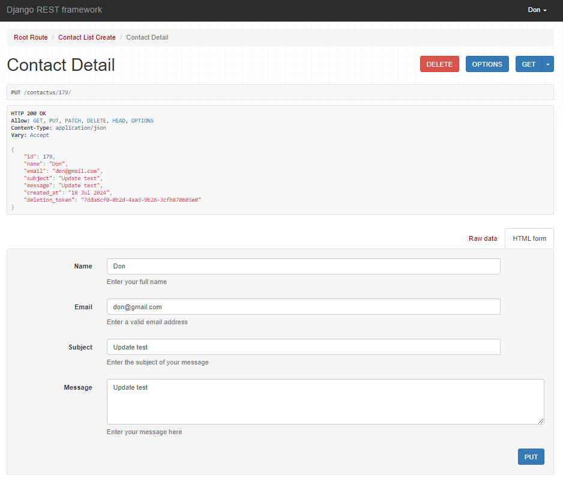

# Diving Center DRF API Testing

This is the TESTING file for the [Diving Center Django Rest Framework API Backend Live Link](https://pp5api-divingspace-f0baea7c564e.herokuapp.com/).

[Diving Center React Frontend Live Link](https://divingspace-900b5a3db777.herokuapp.com/)
and 
[Diving Center React Frontend Github Repo](https://github.com/AmirShkolnik/DivingCenter)

Return back to the [README.md](README.md) file.

## Table of contents

- [Fit\&Fine DRF API Testing](#fitfine-drf-api-testing)
  - [Table of contents](#table-of-contents)
  - [Manual Testing](#manual-testing)
    - [Authentication Endpoints](#authentication-endpoints)
    - [Profile Endpoints](#profile-endpoints)
    - [Post Endpoints](#post-endpoints)
    - [Comment Endpoints](#comment-endpoints)
    - [Daily Routine Endpoints](#daily-routine-endpoints)
    - [Challenge Endpoints](#challenge-endpoints)
    - [Collaborate Endpoints](#collaborate-endpoints)
    - [Like Endpoints](#like-endpoints)
    - [Follower Endpoints](#follower-endpoints)
  - [Automated Testing](#automated-testing)
    - [Challenge Model Tests](#challenge-model-tests)
    - [Collaborate Model Tests](#collaborate-model-tests)
    - [Comment Model Tests](#comment-model-tests)
    - [Daily Routine Model Tests](#daily-routine-model-tests)
    - [Followers Model Tests](#followers-model-tests)
    - [Like Model Tests](#like-model-tests)
    - [Post API Tests](#post-api-tests)
    - [Profile Model Tests](#profile-model-tests)
    - [Running the Tests](#running-the-tests)
  - [Python Validation](#python-validation)
    - [FitandFine\_DRF Project Python Validation Results](#fitandfine_drf-project-python-validation-results)
    - [Profile Module Python Validation Results](#profile-module-python-validation-results)
    - [Posts Module Python Validation Results](#posts-module-python-validation-results)
    - [Comments Module Python Validation Results](#comments-module-python-validation-results)
    - [Daily Routine Module Python Validation Results](#daily-routine-module-python-validation-results)
    - [Challenges Module Python Validation Results](#challenges-module-python-validation-results)
    - [Followers Module Python Validation Results](#followers-module-python-validation-results)
    - [Likes Module Python Validation Results](#likes-module-python-validation-results)
    - [Collaborate Module Python Validation Results](#collaborate-module-python-validation-results)

##  Manual Testing

This document outlines the comprehensive testing process for our diving center's backend API, built using Django REST Framework. The main goal of our testing is to ensure that all parts of the API work correctly and securely. We've created a set of careful tests for each endpoint, covering different user roles like regular users and admins. 

These tests check if users can access the right information, create and change their own data, and if admins have the extra abilities they need. We want to make sure that everyone can use the API as intended, whether they're booking a course, writing a review, or managing the center's activities. By running these tests, we aim to catch any problems early and make our API reliable and user-friendly for all divers and staff members.

### Authentication Endpoints

| Endpoint | Method | CRUD Operation | Description | Images | Expected Result | Actual Result | Pass/Fail |
|----------|--------|----------------|-------------|---------|-----------------|---------------|-----------|
| `/admin/` | GET | Read | Django Admin interface | | Admin interface loads successfully | Admin interface loaded successfully | ✅ |
| `/dj-rest-auth/logout/` | POST | Delete | Custom logout route | <details> <summary>Click to view Logout</summary> </details> | User is logged out and session is terminated | User logged out successfully | ✅ |
| `/dj-rest-auth/login/` | POST | Create | User login | <details><summary>Click to view Login step 1</summary></details> <details><summary>Click to view Login step 2</summary></details> | User is authenticated and receives a token | User authenticated and received token | ✅ |
| `/dj-rest-auth/user/` | GET | Read | Get current user details | <details><summary>Click to view User Get</summary></details> | Returns current user's profile information | Returned correct user profile information | ✅ |
| `/dj-rest-auth/user/` | PUT | Update | Update current user details | <details><summary>Click to view User Put</summary></details> | User details are updated successfully | User details updated correctly | ✅ |
| `/dj-rest-auth/registration/` | POST | Create | User registration | <details><summary>Click to view Registration Post step 1</summary></details> <details><summary>Click to view Registration Post step 2</summary></details> <details><summary>Click to view Registration Post step 3</summary></details>| New user account is created | New user account created successfully | ✅ |

### Profile Endpoints

| Endpoint | Method | CRUD Operation | Description | Images | Expected Result | Actual Result | Pass/Fail |
|----------|--------|----------------|-------------|--------|-----------------|---------------|-----------|
| `/profiles/` | GET | Read | List all profiles | <details><summary>Click to view Profiles List</summary></details> | Returns a list of all user profiles | Returned a list of all user profiles successfully | ✅ |
| `/profiles/{id}/` | GET | Read | Retrieve a specific profile | <details><summary>Click to view Profile Detail</summary></details> | Returns details of a specific user profile | Returned correct details for the specified profile | ✅ |
| `/profiles/{id}/` | PUT | Update | Update a specific profile (owner only) | <details><summary>Click to view Profile Update step 1</summary></details> <details><summary>Click to view Profile Update step 2</summary></details> | Updates the profile details for the authenticated user | Profile details updated successfully for the authenticated user | ✅ |
| `/profiles/{id}/` | PATCH | Update | Partially update a specific profile (owner only) | | Partially updates the profile details for the authenticated user | Profile details partially updated successfully for the authenticated user | ✅ |

### Posts Endpoints

| Endpoint | Method | CRUD Operation | Description | Images | Expected Result | Actual Result | Pass/Fail |
|----------|--------|----------------|-------------|--------|-----------------|---------------|-----------|
| `/posts/` | GET | Read | Retrieve a list of posts | <details><summary>Click to view Posts List</summary></details> | List of posts returned | List of posts returned | ✅ |
| `/posts/` | POST | Create | Create a new post | <details><summary>Click to view Create Post step 1</summary></details> <details><summary>Click to view Create Post step 2</summary></details> | Post created, details returned | Post created, details returned | ✅ |
| `/posts/<id>/` | GET | Read | Retrieve a specific post by ID | <details><summary>Click to view Post Detail</summary></details> | Post details returned | Post details returned | ✅ |
| `/posts/<id>/` | PUT | Update | Update a specific post by ID | <details><summary>Click to view Update Post step 1</summary></details> <details><summary>Click to view Update Post step 2</summary></details> | Post updated, updated details returned | Post updated, updated details returned | ✅ |
| `/posts/<id>/` | PATCH | Update | Partially update a specific post by ID | | Post partially updated, updated details returned | Post partially updated, updated details returned | ✅ |
| `/posts/<id>/` | DELETE | Delete | Delete a specific post by ID | <details><summary>Click to view Delete Post step 1</summary></details> <details><summary>Click to view Delete Post step 2</summary></details> | Post deleted | Post deleted | ✅ |

### Comments Endpoints

| Endpoint | Method | CRUD Operation | Description | Images | Expected Result | Actual Result | Pass/Fail |
|----------|--------|----------------|-------------|--------|-----------------|---------------|-----------|
| `/comments/` | GET | Read | List all comments | <details><summary>Click to view Comments List 1</summary></details> <details><summary>Click to view Comments List 2</summary></details> | Returns a list of all comments | Returned a list of all comments successfully | ✅ |
| `/comments/` | POST | Create | Create a new comment (authenticated users only) | <details><summary>Click to view Create Comment step 1</summary></details> <details><summary>Click to view Create Comment step 2</summary></details> | New comment is created and returned | New comment created and returned successfully | ✅ |
| `/comments/{id}/` | GET | Read | Retrieve a specific comment | <details><summary>Click to view Comment Detail</summary></details> | Returns details of a specific comment | Returned correct details for the specified comment | ✅ |
| `/comments/{id}/` | PUT | Update | Update a specific comment (owner only) | <details><summary>Click to view Update Comment step 1</summary></details> <details><summary>Click to view Update Comment step 2</summary></details> | Updates the comment details for the authenticated owner | Comment details updated successfully for the authenticated owner | ✅ |
| `/comments/{id}/` | PATCH | Update | Partially update a specific comment (owner only) | | Partially updates the comment details for the authenticated owner | Comment details partially updated successfully for the authenticated owner | ✅ |
| `/comments/{id}/` | DELETE | Delete | Delete a specific comment (owner only) | <details><summary>Click to view Delete Comment step 1</summary></details> <details><summary>Click to view Delete Comment step 2</summary></details> | Deletes the specified comment for the authenticated owner | Comment deleted successfully for the authenticated owner | ✅ |

### Likes Endpoints

| Endpoint | Method | CRUD Operation | Description | Images | Expected Result | Actual Result | Pass/Fail |
|----------|--------|----------------|-------------|--------|-----------------|---------------|-----------|
| `/likes/` | GET | Read | List all likes | <details><summary>Click to view Likes List</summary></details> | Returns a list of all likes | Returned a list of all likes successfully | ✅ |
| `/likes/` | POST | Create | Create a new like (authenticated users only) | <details><summary>Click to view Create Like step 1</summary></details> <details><summary>Click to view Create Like step 2</summary></details> | New like is created and returned | New like created and returned successfully | ✅ |
| `/likes/{id}/` | GET | Read | Retrieve a specific like | <details><summary>Click to view Like Detail step 1</summary></details> <details><summary>Click to view Like Detail step 2</summary></details> | Returns details of a specific like | Returned correct details for the specified like | ✅ |
| `/likes/{id}/` | DELETE | Delete | Delete a specific like (owner only) | <details><summary>Click to view Delete Like step 1</summary></details> <details><summary>Click to view Delete Like step 2</summary></details> <details><summary>Click to view Delete Like step 3</summary></details>| Deletes the specified like for the authenticated owner | Like deleted successfully for the authenticated owner | ✅ |

### Followers Endpoints

| Endpoint | Method | CRUD Operation | Description | Images | Expected Result | Actual Result | Pass/Fail |
|----------|--------|----------------|-------------|--------|-----------------|---------------|-----------|
| `/followers/` | GET | Read | List all follower relationships | <details><summary>Click to view Followers List</summary></details> | Returns a list of all follower relationships | Returned a list of all follower relationships successfully | ✅ |
| `/followers/` | POST | Create | Create a new follower relationship (authenticated users only) | <details><summary>Click to view Create Follower</summary></details> | New follower relationship is created and returned | New follower relationship created and returned successfully | ✅ |
| `/followers/{id}/` | GET | Read | Retrieve a specific follower relationship | <details><summary>Click to view Follower Detail</summary></details> | Returns details of a specific follower relationship | Returned correct details for the specified follower relationship | ✅ |
| `/followers/{id}/` | DELETE | Delete | Delete a specific follower relationship (owner only) | <details><summary>Click to view Delete Follower step 1</summary></details> <details><summary>Click to view Delete Follower step 2</summary></details> <details><summary>Click to view Delete Follower step 3</summary></details>| Deletes the specified follower relationship for the authenticated owner | Follower relationship deleted successfully for the authenticated owner | ✅ |

### Bookings Endpoints

| Endpoint | Method | CRUD Operation | Description | Images | Expected Result | Actual Result | Pass/Fail |
|----------|--------|----------------|-------------|--------|-----------------|---------------|-----------|
| `/bookings/` | GET | Read | List all bookings for the authenticated user |   <details><summary>Click to view Bookings List - Authenticated - Empty List</summary></details> <details><summary>Click to view Bookings List - Authenticated - Not Empty</summary></details> <details><summary>Click to view Bookings List - Not Authenticated User</summary></details>| Returns a list of all bookings for the authenticated user | Returned a list of all bookings for the authenticated user successfully | ✅ |
| `/bookings/` | POST | Create | Create a new booking (authenticated users only) | <details><summary>Click to view Create Booking Test - Past Date</summary></details> <details><summary>Click to view Create Booking Test - Booking Same Coures</summary></details> <details><summary>Click to view Create Booking Test - Booking Wrong Date</summary></details> <details><summary>Click to view Create Booking Test - Booking Wrong Time</summary></details>| New booking is created and returned | New booking created and returned successfully | ✅ |
| `/bookings/{id}/` | GET | Read | Retrieve a specific booking | <details><summary>Click to view Booking Detail - Specific Booking</summary></details> | Returns details of a specific booking | Returned correct details for the specified booking | ✅ |
| `/bookings/{id}/` | PUT | Update | Update a specific booking (owner only) | <details><summary>Click to view Update Booking step 1</summary></details> <details><summary>Click to view Update Booking step 2 - Success</summary></details> <details><summary>Click to view Update Booking Test 1 - Update Wrong Time</summary></details> <details><summary>Click to view Update Booking Test 2 - Update Wrong Date</summary></details> <details><summary>Click to view Update Booking Test 3 - Update Past Date</summary></details> <details><summary>Click to view Update Booking Test 4 - Update No Course</summary></details> | Updates the booking details for the authenticated owner | Booking details updated successfully for the authenticated owner | ✅ |
| `/bookings/{id}/` | PATCH | Update | Partially update a specific booking (owner only) | | Partially updates the booking details for the authenticated owner | Booking details partially updated successfully for the authenticated owner | ✅ |
| `/bookings/{id}/` | DELETE | Delete | Delete a specific booking (owner only) | <details><summary>Click to view Delete Booking step 1</summary></details> <details><summary>Click to view Delete Booking step 2 - Delete Success</summary></details> | Deletes the specified booking for the authenticated owner | Booking deleted successfully for the authenticated owner | ✅ |

### Contact Us Endpoints

#### Contact Us Form: User Cases and Functionality

The Contact Us form is designed to accommodate three distinct user types, each with specific permissions and capabilities:

1. **Admin Users**
   - Full access to all messages (read, update, delete)
   - Can perform all operations without needing a deletion token
   - Able to manage messages from all users

2. **Authenticated Users**
   - Can create messages whether logged in or not
   - When logged in, can view, update, and delete their own messages
   - Messages are associated with their account email
   - No deletion token required for managing their messages when logged in

3. **Non-Authenticated Users (Visitors)**
   - Can submit messages through the contact form
   - Receive a deletion token upon message creation
   - Can view, update, or delete their message using the deletion token

### Deletion Token Usage

For non-authenticated users or messages created while logged out, a deletion token is required for management. The token is provided in the response when creating a message and should be used in subsequent requests. For exp. https://your-api-url.com/contactus/177/?deletion_token=05452498-bbde-43a9-bd97-a695ffc8f3aa

This system ensures secure message management for all user types while providing flexibility for users who may create messages before registering or logging in.

Example of using a deletion token to delete a message:

| Endpoint | Method | CRUD Operation | Description | Images | Expected Result | Actual Result | Pass/Fail |
|----------|--------|----------------|-------------|--------|-----------------|---------------|-----------|
| `/contactus/` | GET | Read | List all contact messages | <details><summary>ADMIN - Click to view List All Messages</summary></details> <details><summary>LOGGED IN USER - Click to view List All Messages</summary></details> | Admin sees all messages, regular logged in user sees only their messages | Correct messages displayed based on user role | ✅ |
| `/contactus/{id}/` | GET | Read | Retrieve a specific contact message | <details><summary>ADMIN - Click to view Spesific Message</summary></details> <details><summary>Message OWNER - Click to view a Specific Message</summary></details> | Returns details of a specific message for admin or message owner | Correct access control applied | ✅ |
| `/contactus/` | POST | Create | Create a new contact message | <details><summary>Click to view Create Contact Message step 1 - Empty</summary></details> <details><summary>Click to view Create Contact Message step 2 - Add Message</summary></details> <details><summary>Click to view Create Contact Message step 3 - Success</summary></details> <details><summary>VISITOR - Click to view Create Contact Message step 1 </summary></details> <details><summary>VISITOR - Click to view Create Contact Message step 2</summary></details>| New contact message is created and returned | New contact message created and returned successfully | ✅ |
| `/contactus/{id}/` | PUT | Update | Update an existing contact message | <details><summary>Click to view Update Contact Message step 1</summary></details> <details><summary>Click to view Update Contact Message step 2</summary></details> <details><summary>VISITOR - Click to view Update Contact Message step 1</summary></details> <details><summary>VISITOR - Click to view Update Contact Message step 2</summary></details> <details><summary>VISITOR - Click to view Update Contact Message step 3</summary></details> | Updates the existing contact message | Contact message updated successfully | ✅ |
| `/contactus/{id}` | DELETE | Delete | Delete a specific contact message | <details><summary>LOGGED IN USER / ADMIN - Click to view Delete Contact Message step 1</summary></details> <details><summary>LOGGED IN USER / ADMIN Click to view Delete Contact Message step 2 - Delete Success</summary></details> <details><summary>VISITOR - Click to view Delete Contact Message step 1</summary></details> <details><summary>VISITOR - Click to view Delete Contact Message step 2</summary></details> | Deletes the specified contact message | Contact message deleted successfully | ✅ |

### Courses Endpoints

#### Future Improvements Flexible Course Management System and Dynamic Course Types and Prices

We plan to enhance the flexibility of our Course model by:

1. Removing hardcoded course types and prices.
2. Implementing a system that allows website owners to:
   - Add, edit, or remove course types dynamically.
   - Set custom price points without being restricted to predefined options.

This improvement will provide greater adaptability to changing business needs and course offerings.

| Endpoint | Method | CRUD Operation | Description | Images | Expected Result | Actual Result | Pass/Fail |
|----------|--------|----------------|-------------|--------|-----------------|---------------|-----------|
| `/courses/` | GET | Read | List all courses | <details><summary>Click to view Courses List</summary></details> | Returns a list of all courses | Returned a list of all courses successfully | ✅ |
| `/courses/` | POST | Create | Create a new course (admin only) | <details><summary>Click to view Create Course Test - Missing Fields</summary></details> <details><summary>Click to view Create Course step 1</summary></details> <details><summary>Click to view Create Course step 2 - Success</summary></details> | New course is created and returned (admin only) | New course created and returned successfully (admin only) | ✅ |
| `/courses/{slug}/` | GET | Read | Retrieve a specific course | <details><summary>Click to view Course Detail</summary></details> | Returns details of a specific course | Returned correct details for the specified course | ✅ |
| `/courses/{slug}/` | PUT | Update | Update a specific course (admin only) | <details><summary>Click to view Update Course Test - Missing Fields</summary></details> <details><summary>Click to view Update Course step 1</summary></details> <details><summary>Click to view Update Course step 2 - Success</summary></details>| Updates the course details (admin only) | Course details updated successfully (admin only) | ✅ |
| `/courses/{slug}/` | PATCH | Update | Partially update a specific course (admin only) | | Partially updates the course details (admin only) | Course details partially updated successfully (admin only) | ✅ |
| `/courses/{slug}/` | DELETE | Delete | Delete a specific course (admin only) | <details><summary>Click to view Delete Course step 1</summary></details> <details><summary>Click to view Delete Course step 2 - Success</summary></details> | Deletes the specified course (admin only) | Course deleted successfully (admin only) | ✅ |

### Reviews Endpoints

| Endpoint | Method | CRUD Operation | Description | Images | Expected Result | Actual Result | Pass/Fail |
|----------|--------|----------------|-------------|--------|-----------------|---------------|-----------|
| `/reviews/` | GET | Read | List all reviews | <details><summary>ADMIN - Click to view Reviews List</summary></details> <details><summary>Authenticated USER - Click to view Reviews List</summary></details> | Returns a list of all reviews | Returned a list of all reviews successfully | ✅ |
| `/reviews/` | POST | Create | Create a new review (authenticated users and admin only) | <details><summary>Click to view Create Review Test - Missing Fields</summary></details> <details><summary>Click to view Create Review</summary></details> | New review is created and returned | New review created and returned successfully | ✅ |
| `/reviews/{id}/` | GET | Read | Retrieve a specific review | <details><summary>Click to view Review Detail</summary></details> | Returns details of a specific review | Returned correct details for the specified review | ✅ |
| `/reviews/{id}/` | PUT | Update | Update a specific review (owner and admin only) | <details><summary>ADMIN - Click to view Update Reviews step 1</summary></details> <details><summary>ADMIN - Click to view Update Review step 2</summary></details> <details><summary>ADMIN - Click to view Update Review step 3</summary></details> <details><summary>OWNER - Click to view Update Review step 1</summary></details> <details><summary>OWNER - Click to view Update Review step 2</summary></details> <details><summary>OWNER - Click to view Update Review step 3</summary></details>| Updates the review details for the authenticated owner | Review details updated successfully for the authenticated owner | ✅ |
| `/reviews/{id}/` | PATCH | Update | Partially update a specific review (owner and admin only) | | Partially updates the review details for the authenticated owner | Review details partially updated successfully for the authenticated owner | ✅ |
| `/reviews/{id}/` | DELETE | Delete | Delete a specific review (owner and admin only) | <details><summary>ADMIN - Click to view Delete Review step 1</summary></details> <details><summary>ADMIN - Click to view Delete Review step 2 - Success</summary></details>  <details><summary>OWNER - Click to view Delete Review step 1</summary></details> <details><summary>OWNER - Click to view Delete Review step 2 - Success </summary></details> | Deletes the specified review for the authenticated owner | Review deleted successfully for the authenticated owner | ✅ |

## Automated Testing 

Automated testing is a crucial component of our project's quality assurance process, ensuring the reliability and performance of all models across our codebase. This comprehensive testing suite systematically evaluates each model's functionality, accuracy, and robustness, allowing us to identify and address potential issues early in the development cycle. By implementing automated tests, we maintain code integrity, facilitate easier refactoring, and provide a safety net for continuous integration and deployment workflows, ultimately leading to more stable and efficient software releases.

### Bookings Model Tests

**File:** bookings/tests.py

**Test Results**


| Test Name | Description | Expected Result | Test Result | Explanation | Sources |
|-----------|-------------|-----------------|-------------|-------------|---------|
| 1. test_booking_creation | Tests the string representation of a booking | Correct string format | Pass | Ensures that the booking's string representation is correct | [Django Model __str__](https://docs.djangoproject.com/en/3.2/ref/models/instances/#str) |
| 2. test_booking_date_not_10th | Tests creating a booking with an invalid date | Validation error raised | Pass | Verifies that bookings can only be made on the 10th of each month | [DRF Serializer Validation](https://www.django-rest-framework.org/api-guide/serializers/#validation) |
| 3. test_create_booking | Tests creating a valid booking | Status 201 Created | Pass | Checks that a valid booking can be created successfully | [DRF CreateAPIView](https://www.django-rest-framework.org/api-guide/generic-views/#createapiview) |
| 4. test_create_booking_invalid_date | Tests creating a booking with an invalid date | Status 400 Bad Request | Pass | Ensures that creating a booking with an invalid date is rejected | [DRF Serializer Validation](https://www.django-rest-framework.org/api-guide/serializers/#validation) |
| 5. test_create_booking_invalid_time | Tests creating a booking with an invalid time | Status 400 Bad Request | Pass | Verifies that creating a booking with an invalid time is rejected | [DRF Serializer Validation](https://www.django-rest-framework.org/api-guide/serializers/#validation) |
| 6. test_create_duplicate_booking | Tests creating a duplicate booking | Status 400 Bad Request | Pass | Checks that creating a duplicate booking is not allowed | [DRF Serializer Validation](https://www.django-rest-framework.org/api-guide/serializers/#validation) |
| 7. test_update_booking | Tests updating an existing booking | Status 200 OK | Pass | Ensures that a booking can be updated successfully | [DRF UpdateAPIView](https://www.django-rest-framework.org/api-guide/generic-views/#updateapiview) |
| 8. test_delete_booking | Tests deleting a booking | Status 204 No Content | Pass | Verifies that a booking can be deleted successfully | [DRF DestroyAPIView](https://www.django-rest-framework.org/api-guide/generic-views/#destroyapiview) |
| 9. test_get_bookings | Tests retrieving a list of bookings | Status 200 OK | Pass | Checks that the list of bookings can be retrieved | [DRF ListAPIView](https://www.django-rest-framework.org/api-guide/generic-views/#listapiview) |
| 10. test_get_booking_detail | Tests retrieving a specific booking | Status 200 OK | Pass | Ensures that a specific booking's details can be retrieved | [DRF RetrieveAPIView](https://www.django-rest-framework.org/api-guide/generic-views/#retrieveapiview) |
| 11. test_unauthorized_access | Tests accessing bookings without authentication | Status 401 Unauthorized | Pass | Verifies that unauthenticated users cannot access bookings | [DRF Authentication](https://www.django-rest-framework.org/api-guide/authentication/) |
| 12. test_create_booking_no_course | Tests creating a booking without specifying a course | Status 400 Bad Request | Pass | Checks that creating a booking without a course is rejected | [DRF Serializer Validation](https://www.django-rest-framework.org/api-guide/serializers/#validation) |

### Comments Model Tests

**File:** comments/tests.py

**Test Results**


### Posts Model Tests

**File:** posts/tests.py

**Test Results**


| Test Name | Description | Expected Result | Test Result | Explanation | Sources |
|-----------|-------------|-----------------|-------------|-------------|---------|
| 1. test_retrieve_post_valid_id | Tests retrieving a post with a valid ID | Status 200 OK, Post data returned | Pass | Ensures that a valid post ID returns the correct post data. | [DRF RetrieveAPIView](https://www.django-rest-framework.org/api-guide/generic-views/#retrieveapiview) |
| 2. test_retrieve_post_invalid_id | Tests retrieving a post with an invalid ID | Status 404 Not Found | Pass | Verifies that an invalid post ID returns a 404 error. | [DRF Exceptions](https://www.django-rest-framework.org/api-guide/exceptions/#not-found) |
| 3. test_user_can_update_own_post | Tests if a user can update their own post | Status 200 OK, Post updated | Pass | Checks that authenticated users can update their own posts. | [DRF UpdateAPIView](https://www.django-rest-framework.org/api-guide/generic-views/#updateapiview) |
| 4. test_user_cant_update_another_users_post | Tests if a user can update another user's post | Status 403 Forbidden | Pass | Ensures that users cannot update posts they do not own. | [DRF Permissions](https://www.django-rest-framework.org/api-guide/permissions/#custom-permissions) |
| 5. test_can_list_posts | Tests listing posts | Status 200 OK, Returns the list of posts | Fail | Check if the posts list correctly matches the expected count and data. | [DRF ListAPIView](https://www.django-rest-framework.org/api-guide/generic-views/#listapiview) |
| 6. test_logged_in_user_can_create_post | Tests if a logged-in user can create a post | Status 201 Created, New post created | Pass | Verifies that authenticated users can create new posts. | [DRF CreateAPIView](https://www.django-rest-framework.org/api-guide/generic-views/#createapiview) |
| 7. test_user_not_logged_in_cant_create_post | Tests if a user not logged in can create a post | Status 403 Forbidden | Fail | Ensures that unauthenticated users cannot create posts. | [DRF Authentication](https://www.django-rest-framework.org/api-guide/authentication/) |


### ContactUs Model Tests

**File:** `contactus/tests.py`

**Test Results**


| Test Name | Description | Expected Result | Test Result | Explanation | Resource |
|-----------|-------------|-----------------|-------------|-------------|----------|
| 1. test_create_contact | Tests creating a new contact | Status 201, Contact count increases by 1 | Pass | Verifies that `ContactListCreateView` allows anyone (AllowAny permission) to create a contact. | [Django REST Framework - Testing](https://www.django-rest-framework.org/api-guide/testing/) |
| 2. test_list_contacts_unauthenticated | Tests listing contacts without authentication | Status 401 Unauthorized | Pass | Checks that unauthenticated users cannot list contacts, as `get_permissions` in `ContactListCreateView` returns `[IsAuthenticated()]` for GET requests. | [DRF Permissions](https://www.django-rest-framework.org/api-guide/permissions/) |
| 3. test_list_contacts_authenticated | Tests listing contacts as authenticated user | Status 200, Returns all contacts | Pass | Verifies that authenticated users can list contacts. `get_queryset` in `ContactListCreateView` should return all contacts for authenticated users. | [DRF Generic Views](https://www.django-rest-framework.org/api-guide/generic-views/) |
| 4. test_list_contacts_admin | Tests listing contacts as admin | Status 200, Returns all contacts | Pass | Ensures admin users can list all contacts. `get_queryset` should return all contacts for staff users. | [Django Admin Site](https://docs.djangoproject.com/en/3.2/ref/contrib/admin/) |
| 5. test_retrieve_contact_unauthenticated | Tests retrieving a single contact without authentication | Status 403 Forbidden | Pass | Verifies that `ContactDetailView` forbids unauthenticated users from retrieving a single contact. | [DRF Authentication](https://www.django-rest-framework.org/api-guide/authentication/) |
| 6. test_retrieve_contact_authenticated_owner | Tests retrieving a contact by its owner | Status 200 OK | Pass | Checks that a contact owner can retrieve their own contact. `get_object` in `ContactDetailView` allows this. | [DRF Generics](https://www.django-rest-framework.org/api-guide/generic-views/#retrieveupdatedestroyapiview) |
| 7. test_retrieve_contact_authenticated_non_owner | Tests retrieving a contact by a non-owner | Status 403 Forbidden | Pass | Ensures non-owners are forbidden from retrieving a contact. `get_object` should return None for non-owners. | [DRF Custom Permissions](https://www.django-rest-framework.org/api-guide/permissions/#custom-permissions) |
| 8. test_retrieve_contact_admin | Tests retrieving a contact as admin | Status 200 OK | Pass | Verifies that admin users can retrieve any contact. `get_object` allows this for staff users. | [Django User Model](https://docs.djangoproject.com/en/3.2/ref/contrib/auth/#django.contrib.auth.models.User) |
| 9. test_update_contact_unauthenticated | Tests updating a contact without authentication | Status 403 Forbidden | Pass | Checks that `ContactDetailView` forbids unauthenticated users from updating a contact. | [DRF UpdateAPIView](https://www.django-rest-framework.org/api-guide/generic-views/#updateapiview) |
| 10. test_update_contact_authenticated_owner | Tests updating a contact by its owner | Status 200 OK, Contact updated | Pass | Verifies that a contact owner can update their own contact. The `update` method in `ContactDetailView` allows this. | [DRF Mixins](https://www.django-rest-framework.org/api-guide/generic-views/#mixins) |
| 11. test_delete_contact_unauthenticated | Tests deleting a contact without authentication | Status 403 Forbidden | Pass | Ensures `ContactDetailView` forbids unauthenticated users from deleting a contact. | [DRF DestroyAPIView](https://www.django-rest-framework.org/api-guide/generic-views/#destroyapiview) |
| 12. test_delete_contact_authenticated_non_admin | Tests deleting a contact as non-admin user | Status 403 Forbidden | Pass | Verifies that non-admin users cannot delete contacts. `get_permissions` in `ContactDetailView` only allows admins to delete. | [DRF Custom Permissions](https://www.django-rest-framework.org/api-guide/permissions/#custom-permissions) |
| 13. test_delete_contact_admin | Tests deleting a contact as admin | Status 204 No Content, Contact deleted | Pass | Checks if admin users can delete any contact. `get_permissions` allows this for staff users. | [Django Admin Actions](https://docs.djangoproject.com/en/3.2/ref/contrib/admin/actions/) |
| 14. test_delete_contact_with_token | Tests deleting a contact using deletion token | Status 204 No Content, Contact deleted | Pass | Verifies that a contact can be deleted using its deletion token. `get_object` in `ContactDetailView` allows this when a valid deletion token is provided. | [DRF Token Authentication](https://www.django-rest-framework.org/api-guide/authentication/#tokenauthentication) |


### Challenge Model Tests


**File:** `/workspace/FitandFine-P5/challenges/tests.py`

**Description:** Tests for the Challenge model, ensuring that challenges are created, associated with users, and can be updated correctly.

**Tests:**
- **Challenge Creation:** Verifies that a challenge can be created.
- **User Association:** Ensures a challenge is associated with the correct user.
- **Default Field Values:** Checks the default values for challenge fields.
- **Retrieve by User:** Tests if a challenge can be retrieved by the associated user.
- **Update Fields:** Verifies that challenge fields can be updated correctly.


### Collaborate Model Tests

**File:** `/workspace/FitandFine-P5/collaborate/tests.py`

**Description:** Tests for the About and Collaborate models, ensuring they can be created and updated correctly.

**Tests:**
- **About Creation:** Verifies that an About entry can be created.
- **About Update:** Checks that the About entry can be updated.
- **Collaborate Creation:** Ensures a Collaborate entry can be created.
- **Collaborate Field Values:** Validates the fields of the Collaborate model.


### Comment Model Tests

**File:** `/workspace/FitandFine-P5/comments/tests.py`

**Description:** Tests for the Comment model, ensuring that comments are correctly associated with users and posts.

**Tests:**
- **Comment Creation:** Verifies that a comment can be created.
- **User Association:** Ensures a comment is associated with the correct user.
- **Post Association:** Checks that a comment is associated with the correct post.
- **Comment Content:** Validates the content of the comment.
- **Comment Ordering:** Ensures comments are ordered correctly.


### Daily Routine Model Tests

**File:** `/workspace/FitandFine-P5/dailyroutines/tests.py`

**Description:** Tests for the Daily Routine model, ensuring routines are valid and realistic.

**Tests:**
- **Routine Creation:** Verifies that a daily routine can be created.
- **Date Validation:** Ensures the date is not set in the future.
- **Update Mood:** Tests updating the mood of a routine.
- **Profile Link:** Ensures routines link to the user's profile.
- **Water Intake Validation:** Checks for realistic water intake values.
- **Default Junk Food Setting:** Verifies the default setting for junk food consumption.


### Followers Model Tests

**File:** `/workspace/FitandFine-P5/followers/tests.py`

**Description:** Tests for the Follower model, ensuring follower relationships are managed correctly.

**Tests:**
- **Follower Creation:** Verifies that a follower relationship can be created.
- **Owner Association:** Ensures a follower is associated with the correct owner.
- **Followed Association:** Checks that a follower is associated with the correct followed user.
- **Unique Follower:** Validates that duplicate follower relationships are not allowed.


### Like Model Tests

**File:** `/workspace/FitandFine-P5/likes/tests.py`

**Description:** Tests for the Like model, ensuring likes are managed correctly.

**Tests:**
- **Like Creation:** Verifies that a like can be created.
- **User Association:** Ensures a like is associated with the correct user.
- **Post Association:** Checks that a like is associated with the correct post.
- **Unique Like:** Validates that duplicate likes are not allowed.


### Post API Tests

**File:** `/workspace/FitandFine-P5/posts/tests.py`

**Description:** Tests for the Post API, ensuring that users can list, create, and update posts correctly.

**Tests:**
- **List Posts:** Ensures posts can be listed.
- **Create Post (Logged In):** Verifies that a logged-in user can create a post.
- **Create Post (Not Logged In):** Ensures that a non-logged-in user cannot create a post.
- **Retrieve Post by ID:** Checks that a post can be retrieved using a valid ID.
- **Update Post (Own Post):** Verifies that a user can update their own post.
- **Update Post (Others' Post):** Ensures a user cannot update another user's post.


### Profile Model Tests

**File:** `/workspace/FitandFine-P5/profiles/tests.py`

**Description:** Tests for the Profile model, ensuring profiles are created and associated with users correctly.

**Tests:**
- **Profile Creation on User Creation:** Ensures a profile is created when a user is created.
- **User Association:** Checks that a profile is associated with the correct user.
- **Default Field Values:** Verifies the default values for profile fields.
- **Retrieve Profile by User ID:** Ensures a profile can be retrieved by user ID.
- **Update Profile Fields:** Validates that profile fields can be updated correctly.


### Running the Tests

To run the tests, use the following command:
```bash
python manage.py test
```
This command will execute all the tests and provide a summary of the results.

## Python Validation

- **Tool Used:** [CI Python Linter](https://pep8ci.herokuapp.com/#)
- **Purpose:** Analyzes Python source code to identify coding errors, enforce a coding standard, and look for code smells.
- **Process:** Python code within the Diving Center application is analyzed with Pylint to ensure adherence to coding standards and to improve code quality.

### FitandFine_DRF Project Python Validation Results
| Python File                | Results Screenshots                                | Errors | Warnings |
|----------------------------|----------------------------------------------------|--------|----------|
| **settings.py**            |  | 0      | 6        |
| **manage.py**              |    | 0      | 0        |
| **urls.py**                |      | 0      | 0        |
| **views.py**               |     | 0      | 0        |
| **serializers.py**                |      | 0      | 0        |
| **permissions.py**               |     | 0      | 0        |
| **wsgi.py**                |      | 0      | 0        |
| **asgi.py**                |      | 0      | 0        |

### Profile Module Python Validation Results
| Python File                | Results Screenshots                                | Errors | Warnings |
|----------------------------|----------------------------------------------------|--------|----------|
| **views.py**               |     | 0      | 0        |
| **models.py**              |    | 0      | 0        |
| **urls.py**                |      | 0      | 0        |
| **admin.py**               |     | 0      | 0        |
| **apps.py**                |      | 0      | 0        |
| **serializers.py**         |  | 0   | 0        |
| **tests.py**               |     | 0      | 0        |

### Posts Module Python Validation Results
| Python File                | Results Screenshots                                | Errors | Warnings |
|----------------------------|----------------------------------------------------|--------|----------|
| **views.py**               |     | 0      | 1        |
| **models.py**              |    | 0      | 2        |
| **urls.py**                |      | 0      | 0        |
| **admin.py**               |     | 0      | 0        |
| **apps.py**                |      | 0      | 0        |
| **serializers.py**         |  | 0   | 0        |
| **tests.py**               |     | 0      | 0        |

### Comments Module Python Validation Results
| Python File                | Results Screenshots                                | Errors | Warnings |
|----------------------------|----------------------------------------------------|--------|----------|
| **views.py**               |     | 0      | 0        |
| **models.py**              |    | 0      | 0        |
| **urls.py**                |      | 0      | 0        |
| **admin.py**               |     | 0      | 0        |
| **apps.py**                |      | 0      | 0        |
| **serializers.py**         |  | 0   | 0        |
| **tests.py**               |     | 0      | 0        |

### Daily Routine Module Python Validation Results
| Python File                | Results Screenshots                                | Errors | Warnings |
|----------------------------|----------------------------------------------------|--------|----------|
| **views.py**               |     | 0      | 0        |
| **models.py**              |    | 0      | 2        |
| **urls.py**                |      | 0      | 0        |
| **admin.py**               |     | 0      | 0        |
| **apps.py**                |      | 0      | 0        |
| **serializers.py**         |  | 0   | 0        |
| **tests.py**               |     | 0      | 0        |

### Challenges Module Python Validation Results
| Python File                | Results Screenshots                                | Errors | Warnings |
|----------------------------|----------------------------------------------------|--------|----------|
| **views.py**               |     | 0      | 0        |
| **models.py**              |    | 0      | 0        |
| **urls.py**                |      | 0      | 0        |
| **admin.py**               |     | 0      | 0        |
| **apps.py**                |      | 0      | 0        |
| **serializers.py**         |  | 0   | 0        |
| **tests.py**               |     | 0      | 0        |

### Followers Module Python Validation Results
| Python File                | Results Screenshots                                | Errors | Warnings |
|----------------------------|----------------------------------------------------|--------|----------|
| **views.py**               |     | 0      | 0        |
| **models.py**              |    | 0      | 0        |
| **urls.py**                |      | 0      | 0        |
| **admin.py**               |     | 0      | 0        |
| **apps.py**                |      | 0      | 0        |
| **serializers.py**         |  | 0   | 0        |
| **tests.py**               |     | 0      | 0        |

### Likes Module Python Validation Results
| Python File                | Results Screenshots                                | Errors | Warnings |
|----------------------------|----------------------------------------------------|--------|----------|
| **views.py**               |     | 0      | 0        |
| **models.py**              |    | 0      | 0        |
| **urls.py**                |      | 0      | 0        |
| **admin.py**               |     | 0      | 0        |
| **apps.py**                |      | 0      | 0        |
| **serializers.py**         |  | 0   | 0        |
| **tests.py**               |     | 0      | 0        |

### Collaborate Module Python Validation Results
| Python File                | Results Screenshots                                | Errors | Warnings |
|----------------------------|----------------------------------------------------|--------|----------|
| **views.py**               |     | 0      | 0        |
| **models.py**              |    | 0      | 0        |
| **urls.py**                |      | 0      | 0        |
| **admin.py**               |     | 0      | 0        |
| **apps.py**                |      | 0      | 0        |
| **serializers.py**         |  | 0   | 0        |
| **tests.py**               |     | 0      | 0        |